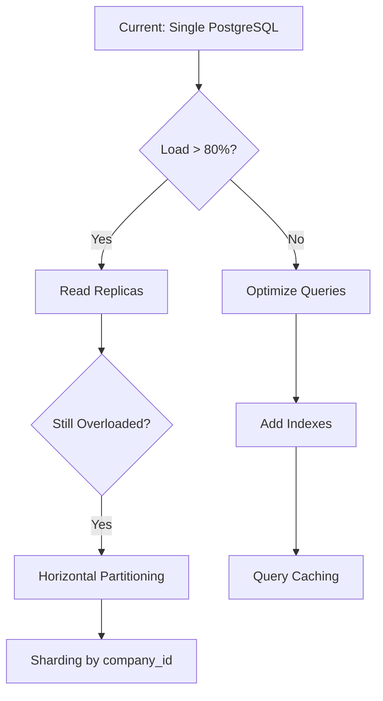

# Planejamento Detalhado do Banco de Dados e Armazenamento da Aplicação de Geração de GNRE

## 📊 Visão Geral

Este documento detalha a estratégia de dados para o sistema GNRE, incluindo modelagem, segurança, performance, backup/recovery e observabilidade.

## 🎯 SLA/SLO para Dados

| Métrica | Target | Medição |
|---------|--------|---------|
| Disponibilidade | 99.9% | Uptime mensal |
| Tempo de Resposta | P95 < 100ms | Queries simples |
| Backup Recovery | RTO: 15min, RPO: 1h | Testes mensais |
| Consistência | 100% | Transações ACID |

## 5. Banco de Dados e Armazenamento

### 5.1. Banco de Dados (Supabase / PostgreSQL)

*   **Escolha:** `Supabase (PostgreSQL)` é a escolha unânime e robusta para o banco de dados, oferecendo PostgreSQL gerenciado, autenticação e RLS.
*   **Modelo de Dados:**
    *   Tabelas: `companies`, `users`, `gnres`, `certificates`, `subscriptions`, `api_tokens`, `audit_log`, `gnre_batches`, `gnre_batch_items`.
    *   Campos de auditoria (`created_at`, `updated_at`, `user_id` para ações críticas).
    *   Enums para status (`GNREStatus`, `UserRole`).
*   **Segurança:**
    *   **Row-Level Security (RLS):** Ativação e políticas explícitas em todas as tabelas com dados de clientes para garantir que usuários só acessem seus próprios dados.
    *   **Criptografia em Nível de Coluna:** Uso de `pgcrypto` para criptografar campos ultra-sensíveis (ex: senha do certificado digital).
    *   **Gerenciamento de Acesso:** Roles no PostgreSQL com permissões limitadas para a API.
    *   **Backups:** Backups diários criptografados e geograficamente redundantes.
    *   **MFA:** Habilitar MFA para administradores do Supabase.
    *   **Políticas de Senha Forte:** Integradas com o Supabase Auth.
*   **Performance:**
    *   Criação de índices em colunas frequentemente consultadas (`company_id`, `status`, `created_at`).
    *   Índices para busca de texto (`to_tsvector`).
    *   Otimização de queries.

### 5.2. Armazenamento de Objetos (MinIO)

*   **Escolha:** `MinIO` é a escolha consistente para armazenamento de objetos S3-compatível e auto-hospedado.
*   **Estrutura de Buckets:**
    *   `gnre-xmls`: XMLs originais.
    *   `gnre-pdfs`: PDFs das guias.
    *   `digital-certificates`: Certificados digitais (acesso restrito).
*   **Estrutura de Pastas (Object Keys):** Organização por `{company_id}/{year}/{month}/{file_id}.ext`.
*   **Segurança e Acesso:**
    *   Buckets **NÃO PÚBLICOS**.
    *   Acesso via API usando chaves de acesso (`Access Key/Secret Key`).
    *   `URLs Pré-Assinadas (Presigned URLs)` com tempo de expiração curto para downloads no frontend.
    *   Políticas de acesso restritivas (`IAM`) no MinIO, com "negação por padrão".
    *   Validação do lado do servidor e varredura de malware (`ClamAV`) em uploads.
    *   Criptografia em repouso (`SSE-S3`) e em trânsito (`HTTPS/TLS`).
    *   Logs de acesso e alertas para atividades anormais.

## 2.3. Definir Modelos de Dados (Supabase/PostgreSQL):

*   **Revisar e Finalizar Schema SQL:**
    *   `companies`: `id`, `owner_id`, `name`, `cnpj`, `created_at`, `updated_at`.
    *   `users`: `id`, `email`, `password_hash`, `name`, `role`, `company_id`, `created_at`, `updated_at`.
    *   `gnres`: `id`, `company_id`, `nfe_key`, `nfe_number`, `client_name`, `uf`, `due_date`, `payment_date`, `amount`, `status`, `protocol_number`, `xml_storage_path`, `pdf_storage_path`, `created_at`, `updated_at`.
    *   `certificates`: `id`, `company_id`, `name`, `validity`, `encrypted_file_path`, `encrypted_password`, `is_active`, `created_at`.
    *   `api_tokens`: `id`, `company_id`, `token_hash`, `created_at`, `last_used_at`.
    *   `gnre_batches`: `id`, `company_id`, `status`, `sent_at`, `response_message`.
    *   `gnre_batch_items`: `gnre_id`, `batch_id` (tabela de junção).
    *   `subscriptions`: `id`, `company_id`, `gateway_customer_id`, `plan_type`, `status`, `current_period_end`.
    *   `audit_log`: `id`, `user_id`, `company_id`, `action`, `details` (JSONB), `created_at`.
*   **Definir Enums:** `UserRole` (`ADMIN`, `USER`), `GNREStatus` (`PENDENTE`, `PROCESSANDO`, `GERADO`, `PAGO`, `CANCELADO`, `ERRO`).
*   **Índices para Performance:**
    *   `idx_gnres_company_id` on `gnres(company_id)`.
    *   `idx_gnres_status` on `gnres(status)`.
    *   `idx_gnres_created_at` on `gnres(created_at DESC)`.
    *   `idx_gnres_compound` on `gnres(company_id, status, created_at DESC)`.
    *   `idx_gnres_cliente_gin` on `gnres` using `gin(to_tsvector('portuguese', cliente))` for full-text search.
## 🔄 Estratégia de Backup e Disaster Recovery

### 6.1. Backup Strategy
```yaml
backup_strategy:
  frequency:
    full_backup: "daily_at_02:00_UTC"
    incremental: "every_6_hours"
    transaction_log: "continuous"

  retention:
    daily: "30_days"
    weekly: "12_weeks"
    monthly: "12_months"
    yearly: "7_years"

  storage:
    primary: "supabase_managed"
    secondary: "aws_s3_cross_region"
    encryption: "AES_256"
```

### 6.2. Disaster Recovery
- **RTO (Recovery Time Objective):** 15 minutos
- **RPO (Recovery Point Objective):** 1 hora
- **Testes de Recovery:** Mensais automatizados
- **Failover:** Automático para região secundária

## 📊 Observabilidade e Monitoramento

### 7.1. Métricas Críticas
```sql
-- Métricas de Performance
SELECT
  schemaname,
  tablename,
  n_tup_ins as inserts,
  n_tup_upd as updates,
  n_tup_del as deletes,
  n_live_tup as live_tuples,
  n_dead_tup as dead_tuples
FROM pg_stat_user_tables;

-- Queries Lentas
SELECT
  query,
  calls,
  total_time,
  mean_time,
  rows
FROM pg_stat_statements
WHERE mean_time > 1000
ORDER BY mean_time DESC;
```

### 7.2. Alertas Configurados
- **Conexões ativas > 80%** da capacidade
- **Query time > 5 segundos**
- **Disk usage > 85%**
- **Backup failure**
- **Replication lag > 30 segundos**

## 🔧 Migrações e CI/CD

### 8.1. Estratégia de Migração
```python
# alembic/versions/001_initial_schema.py
from alembic import op
import sqlalchemy as sa

def upgrade():
    # Forward migration
    op.create_table(
        'companies',
        sa.Column('id', sa.UUID(), primary_key=True),
        sa.Column('name', sa.String(255), nullable=False),
        sa.Column('cnpj', sa.String(14), nullable=False, unique=True),
        sa.Column('created_at', sa.DateTime(), server_default=sa.func.now()),
        sa.Column('updated_at', sa.DateTime(), onupdate=sa.func.now())
    )

def downgrade():
    # Rollback migration
    op.drop_table('companies')
```

### 8.2. Pipeline de Migração
```yaml
# .github/workflows/db-migration.yml
name: Database Migration
on:
  push:
    paths: ['migrations/**']

jobs:
  migrate:
    runs-on: ubuntu-latest
    steps:
      - name: Run Migration (Staging)
        run: alembic upgrade head
        env:
          DATABASE_URL: ${{ secrets.STAGING_DB_URL }}

      - name: Run Tests
        run: pytest tests/integration/

      - name: Run Migration (Production)
        if: github.ref == 'refs/heads/main'
        run: alembic upgrade head
        env:
          DATABASE_URL: ${{ secrets.PROD_DB_URL }}
```

## 📈 Escalabilidade e Performance

### 9.1. Estratégia de Scaling


### 9.2. Particionamento de Tabelas
```sql
-- Particionamento da tabela gnres por data
CREATE TABLE gnres_2024 PARTITION OF gnres
FOR VALUES FROM ('2024-01-01') TO ('2025-01-01');

CREATE TABLE gnres_2025 PARTITION OF gnres
FOR VALUES FROM ('2025-01-01') TO ('2026-01-01');
```

## 🔒 Compliance e Retenção de Dados

### 10.1. Política de Retenção
```yaml
data_retention:
  gnres:
    active: "7_years"  # Obrigação fiscal
    archived: "indefinite"

  audit_logs:
    security: "5_years"
    access: "2_years"

  user_data:
    active_users: "while_active"
    inactive_users: "2_years_after_last_login"
    deleted_users: "30_days_grace_period"
```

### 10.2. LGPD Compliance
```sql
-- Função para anonimização de dados
CREATE OR REPLACE FUNCTION anonymize_user_data(user_id UUID)
RETURNS VOID AS $$
BEGIN
    UPDATE users SET
        email = 'anonymized_' || user_id || '@deleted.local',
        name = 'Usuário Removido',
        phone = NULL,
        updated_at = NOW()
    WHERE id = user_id;

    -- Manter dados fiscais por obrigação legal
    UPDATE gnres SET
        client_name = 'Cliente Anonimizado'
    WHERE company_id IN (
        SELECT company_id FROM users WHERE id = user_id
    );
END;
$$ LANGUAGE plpgsql;
```

## 💰 Monitoramento de Custos

### 11.1. Cost Tracking
```yaml
cost_monitoring:
  supabase:
    database_size: "monitor_daily"
    bandwidth: "monitor_hourly"
    compute_hours: "track_per_project"

  minio:
    storage_used: "monitor_daily"
    requests: "monitor_hourly"
    bandwidth: "track_egress"

  alerts:
    monthly_budget_80_percent: "email_admin"
    unexpected_spike_50_percent: "slack_alert"
```

## 🚀 Otimizações Avançadas de Performance

### 12.1. Índices Inteligentes e Estatísticas
```sql
-- Índices compostos otimizados
CREATE INDEX CONCURRENTLY idx_gnres_company_status_date
ON gnres (company_id, status, created_at DESC)
WHERE status IN ('PENDENTE', 'PROCESSANDO', 'GERADO');

-- Índice parcial para consultas frequentes
CREATE INDEX CONCURRENTLY idx_gnres_active
ON gnres (id, created_at)
WHERE status != 'CANCELADO' AND deleted_at IS NULL;

-- Índice para busca textual
CREATE INDEX CONCURRENTLY idx_gnres_search
ON gnres USING gin(to_tsvector('portuguese', client_name || ' ' || coalesce(description, '')));

-- Estatísticas customizadas
ALTER TABLE gnres ALTER COLUMN company_id SET STATISTICS 1000;
ALTER TABLE gnres ALTER COLUMN status SET STATISTICS 1000;
ALTER TABLE gnres ALTER COLUMN created_at SET STATISTICS 1000;

-- Função para análise automática
CREATE OR REPLACE FUNCTION auto_analyze_tables()
RETURNS void AS $$
DECLARE
    table_name text;
BEGIN
    FOR table_name IN
        SELECT tablename FROM pg_tables WHERE schemaname = 'public'
    LOOP
        EXECUTE 'ANALYZE ' || table_name;
    END LOOP;
END;
$$ LANGUAGE plpgsql;

-- Agendar análise automática
SELECT cron.schedule('auto-analyze', '0 2 * * *', 'SELECT auto_analyze_tables();');
```

### 12.2. Particionamento Avançado
```sql
-- Particionamento híbrido (por data + hash)
CREATE TABLE gnres_partitioned (
    id UUID DEFAULT gen_random_uuid(),
    company_id UUID NOT NULL,
    status VARCHAR(20) NOT NULL,
    created_at TIMESTAMP WITH TIME ZONE DEFAULT NOW(),
    -- ... outras colunas
) PARTITION BY RANGE (created_at);

-- Partições por trimestre
CREATE TABLE gnres_2024_q1 PARTITION OF gnres_partitioned
FOR VALUES FROM ('2024-01-01') TO ('2024-04-01');

CREATE TABLE gnres_2024_q2 PARTITION OF gnres_partitioned
FOR VALUES FROM ('2024-04-01') TO ('2024-07-01');

-- Sub-particionamento por hash para distribuição
CREATE TABLE gnres_2024_q1_hash_0 PARTITION OF gnres_2024_q1
FOR VALUES WITH (modulus 4, remainder 0);

CREATE TABLE gnres_2024_q1_hash_1 PARTITION OF gnres_2024_q1
FOR VALUES WITH (modulus 4, remainder 1);

-- Função para criação automática de partições
CREATE OR REPLACE FUNCTION create_quarterly_partitions(start_date date, num_quarters int)
RETURNS void AS $$
DECLARE
    quarter_start date;
    quarter_end date;
    table_name text;
    i int;
BEGIN
    FOR i IN 0..num_quarters-1 LOOP
        quarter_start := start_date + (i * interval '3 months');
        quarter_end := quarter_start + interval '3 months';
        table_name := 'gnres_' || to_char(quarter_start, 'YYYY_Q"q"Q');

        EXECUTE format('CREATE TABLE IF NOT EXISTS %I PARTITION OF gnres_partitioned
                       FOR VALUES FROM (%L) TO (%L)',
                       table_name, quarter_start, quarter_end);
    END LOOP;
END;
$$ LANGUAGE plpgsql;

-- Criar partições para próximos 2 anos
SELECT create_quarterly_partitions('2024-01-01'::date, 8);
```

### 12.3. Replicação e Read Replicas
```sql
-- Configuração de replicação streaming
-- postgresql.conf
wal_level = replica
max_wal_senders = 3
max_replication_slots = 3
synchronous_commit = on
synchronous_standby_names = 'replica1'

-- pg_hba.conf
host replication replicator 10.0.0.0/8 md5

-- Função para monitoramento de lag de replicação
CREATE OR REPLACE FUNCTION check_replication_lag()
RETURNS TABLE(
    client_addr inet,
    client_hostname text,
    state text,
    sent_lsn pg_lsn,
    write_lsn pg_lsn,
    flush_lsn pg_lsn,
    replay_lsn pg_lsn,
    write_lag interval,
    flush_lag interval,
    replay_lag interval
) AS $$
BEGIN
    RETURN QUERY
    SELECT
        pg_stat_replication.client_addr,
        pg_stat_replication.client_hostname,
        pg_stat_replication.state,
        pg_stat_replication.sent_lsn,
        pg_stat_replication.write_lsn,
        pg_stat_replication.flush_lsn,
        pg_stat_replication.replay_lsn,
        pg_stat_replication.write_lag,
        pg_stat_replication.flush_lag,
        pg_stat_replication.replay_lag
    FROM pg_stat_replication;
END;
$$ LANGUAGE plpgsql;
```

## 🔒 Segurança Avançada de Dados

### 13.1. Row Level Security (RLS) Granular
```sql
-- Habilitar RLS em todas as tabelas sensíveis
ALTER TABLE companies ENABLE ROW LEVEL SECURITY;
ALTER TABLE users ENABLE ROW LEVEL SECURITY;
ALTER TABLE gnres ENABLE ROW LEVEL SECURITY;
ALTER TABLE certificates ENABLE ROW LEVEL SECURITY;

-- Políticas granulares por role
CREATE POLICY company_isolation ON companies
FOR ALL TO app_user
USING (id = current_setting('app.current_company_id')::uuid);

CREATE POLICY user_company_access ON users
FOR ALL TO app_user
USING (company_id = current_setting('app.current_company_id')::uuid);

CREATE POLICY gnre_company_access ON gnres
FOR ALL TO app_user
USING (company_id = current_setting('app.current_company_id')::uuid);

-- Política para auditores (acesso read-only cross-company)
CREATE POLICY auditor_read_access ON gnres
FOR SELECT TO auditor_role
USING (true);

-- Política para super admins
CREATE POLICY admin_full_access ON gnres
FOR ALL TO admin_role
USING (true);

-- Função para definir contexto de segurança
CREATE OR REPLACE FUNCTION set_security_context(
    p_user_id uuid,
    p_company_id uuid,
    p_role text
)
RETURNS void AS $$
BEGIN
    PERFORM set_config('app.current_user_id', p_user_id::text, true);
    PERFORM set_config('app.current_company_id', p_company_id::text, true);
    PERFORM set_config('app.current_role', p_role, true);
END;
$$ LANGUAGE plpgsql SECURITY DEFINER;
```

### 13.2. Criptografia Transparente de Dados
```sql
-- Extensão para criptografia
CREATE EXTENSION IF NOT EXISTS pgcrypto;

-- Função para criptografia de campos sensíveis
CREATE OR REPLACE FUNCTION encrypt_sensitive_data(data text, key_id text)
RETURNS bytea AS $$
BEGIN
    -- Usar chave específica do KMS baseada no key_id
    RETURN pgp_sym_encrypt(data, current_setting('app.encryption_key_' || key_id));
END;
$$ LANGUAGE plpgsql SECURITY DEFINER;

CREATE OR REPLACE FUNCTION decrypt_sensitive_data(encrypted_data bytea, key_id text)
RETURNS text AS $$
BEGIN
    RETURN pgp_sym_decrypt(encrypted_data, current_setting('app.encryption_key_' || key_id));
END;
$$ LANGUAGE plpgsql SECURITY DEFINER;

-- Tabela para dados criptografados
CREATE TABLE encrypted_certificates (
    id UUID PRIMARY KEY DEFAULT gen_random_uuid(),
    company_id UUID NOT NULL REFERENCES companies(id),
    certificate_name VARCHAR(255) NOT NULL,
    certificate_data BYTEA NOT NULL, -- Dados criptografados
    key_id VARCHAR(50) NOT NULL,     -- ID da chave no KMS
    created_at TIMESTAMP WITH TIME ZONE DEFAULT NOW(),
    updated_at TIMESTAMP WITH TIME ZONE DEFAULT NOW()
);

-- View para acesso transparente
CREATE VIEW certificates AS
SELECT
    id,
    company_id,
    certificate_name,
    decrypt_sensitive_data(certificate_data, key_id) as certificate_content,
    created_at,
    updated_at
FROM encrypted_certificates;

-- Trigger para criptografia automática
CREATE OR REPLACE FUNCTION encrypt_certificate_trigger()
RETURNS TRIGGER AS $$
BEGIN
    IF TG_OP = 'INSERT' THEN
        INSERT INTO encrypted_certificates (
            id, company_id, certificate_name, certificate_data, key_id
        ) VALUES (
            NEW.id,
            NEW.company_id,
            NEW.certificate_name,
            encrypt_sensitive_data(NEW.certificate_content, NEW.company_id::text),
            NEW.company_id::text
        );
        RETURN NEW;
    END IF;
    RETURN NULL;
END;
$$ LANGUAGE plpgsql;

CREATE TRIGGER encrypt_certificate_insert
    INSTEAD OF INSERT ON certificates
    FOR EACH ROW EXECUTE FUNCTION encrypt_certificate_trigger();
```

## 📊 Analytics e Business Intelligence

### 14.1. Materialized Views para Relatórios
```sql
-- View materializada para dashboard executivo
CREATE MATERIALIZED VIEW dashboard_metrics AS
SELECT
    DATE_TRUNC('day', created_at) as date,
    company_id,
    COUNT(*) as total_gnres,
    COUNT(*) FILTER (WHERE status = 'GERADO') as gnres_generated,
    COUNT(*) FILTER (WHERE status = 'ERRO') as gnres_failed,
    SUM(amount) as total_amount,
    AVG(amount) as avg_amount,
    PERCENTILE_CONT(0.5) WITHIN GROUP (ORDER BY amount) as median_amount
FROM gnres
WHERE created_at >= CURRENT_DATE - INTERVAL '90 days'
GROUP BY DATE_TRUNC('day', created_at), company_id;

-- Índice para performance
CREATE UNIQUE INDEX idx_dashboard_metrics_date_company
ON dashboard_metrics (date, company_id);

-- Refresh automático
SELECT cron.schedule('refresh-dashboard', '*/15 * * * *',
    'REFRESH MATERIALIZED VIEW CONCURRENTLY dashboard_metrics;');

-- View para análise de tendências
CREATE MATERIALIZED VIEW trend_analysis AS
WITH monthly_stats AS (
    SELECT
        DATE_TRUNC('month', created_at) as month,
        company_id,
        COUNT(*) as gnre_count,
        SUM(amount) as total_amount
    FROM gnres
    WHERE created_at >= CURRENT_DATE - INTERVAL '24 months'
    GROUP BY DATE_TRUNC('month', created_at), company_id
),
growth_calc AS (
    SELECT
        *,
        LAG(gnre_count) OVER (PARTITION BY company_id ORDER BY month) as prev_count,
        LAG(total_amount) OVER (PARTITION BY company_id ORDER BY month) as prev_amount
    FROM monthly_stats
)
SELECT
    month,
    company_id,
    gnre_count,
    total_amount,
    CASE
        WHEN prev_count > 0 THEN
            ROUND(((gnre_count - prev_count)::numeric / prev_count * 100), 2)
        ELSE NULL
    END as count_growth_percent,
    CASE
        WHEN prev_amount > 0 THEN
            ROUND(((total_amount - prev_amount) / prev_amount * 100), 2)
        ELSE NULL
    END as amount_growth_percent
FROM growth_calc;
```

---

*Este documento é atualizado automaticamente com cada migração de schema e revisado mensalmente pela equipe de dados.*