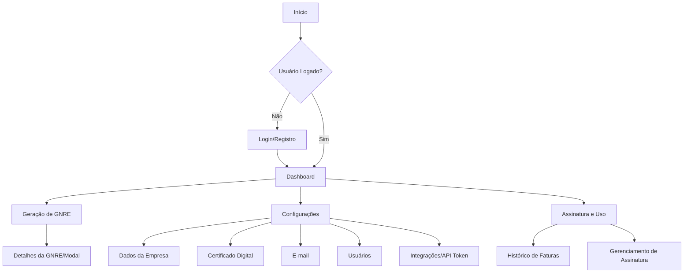

# Planejamento Detalhado do Frontend da Aplicação de Geração de GNRE

## 2. Frontend (Portal Web)

O Frontend será uma Single Page Application (SPA) reativa e moderna, focada na experiência do usuário, com ênfase em segurança e performance.

### 2.1. Stack Tecnológica Consolidada

*   **Framework:** `React 18.3.1` com `Next.js 14+ (App Router)` para renderização híbrida (SSR para páginas públicas/SEO, CSR para dashboard interativo). A escolha do Next.js, embora não explicitamente mencionada no `FRONT.md`, é uma recomendação forte dos outros agentes (`Claude`, `GEMINI`, `OpenAI`) para otimização de performance e segurança (CSP headers automáticos).
*   **Linguagem:** `TypeScript 5.5.3` para tipagem estática e segurança de código.
*   **Estilização:** `Tailwind CSS 3.4.1` para desenvolvimento rápido e consistente de UI, complementado por `Shadcn UI` ou `Tremor React 3.14.1` para componentes de dashboard e analytics. A preferência do `FRONT.md` por `Tremor React` é mantida, mas `Shadcn UI` pode ser considerado para componentes mais genéricos.
*   **Gerenciamento de Estado:** `Zustand` (conforme `Claude` e `GEMINI`) ou `Context API` (conforme `FRONT.md`). A recomendação é iniciar com `Context API` para estados mais simples e migrar para `Zustand` ou `Redux Toolkit` se a complexidade do estado global aumentar, priorizando a simplicidade inicial.
*   **Formulários:** `React Hook Form` com `Zod` (validação) para gerenciamento e validação robusta de formulários.
*   **Comunicação com API:** `Axios` ou `TanStack Query (React Query)` para data fetching, cache e sincronização. `TanStack Query` é preferível para otimização de performance e experiência do desenvolvedor.
*   **Roteamento:** `React Router DOM 6.22.3` para roteamento client-side, com `Protected Routes Pattern`.
*   **Build Tools:** `Vite 6.3.5` para desenvolvimento rápido e `esbuild`/`Rollup`/`SWC` para otimização de produção.

### 2.2. Funcionalidades Principais

*   **Login e Autenticação:**
    *   Fluxo de login com e-mail/senha, recuperação de senha.
    *   Autenticação baseada em `JWT` com `refresh tokens` (armazenados em `HttpOnly`, `Secure`, `SameSite=Strict` cookies para segurança máxima).
    *   `Middleware` de proteção de rotas.
    *   Implementação de `MFA` (Multi-Factor Authentication) como TOTP, SMS, e-mail (conforme `Claude`).
    *   Políticas de senha robustas (mínimo 12 caracteres, complexidade, rotação).
    *   `Rate limiting` e bloqueio de tentativas de `brute-force`.
*   **Dashboard:**
    *   Visão geral com KPIs (GNREs geradas, pendentes, valor total).
    *   Gráficos de uso mensal/semanal.
    *   Alertas de vencimento de certificados ou GNREs.
*   **Tela de Geração de GNRE:**
    *   `UploadZone` (drag & drop) para múltiplos XMLs com validação de formato e tamanho.
    *   `GNRETable` com virtualização para grandes volumes, filtros, paginação, seleção múltipla.
    *   Ações por item (Gerar PDF, Impressão, Recálculo, Exclusão) e ações em lote.
    *   Exportação para layout bancário (`.rem`).
*   **Tela de Configurações:**
    *   Dados da Empresa (CNPJ, Razão Social, Endereço).
    *   `Upload` e gerenciamento de Certificado Digital (`.pfx`, `.p12`) com indicação de validade.
    *   Configurações de E-mail (SMTP).
    *   Gerenciamento de Usuários (CRUD, papéis).
    *   Geração e cópia de `Token da API` para aplicação local.
*   **Tela de Assinatura e Uso:**
    *   Integração com gateway de pagamento (Stripe/Pagar.me).
    *   Exibição do plano atual e medidor de uso.
    *   Histórico de faturas.

### 2.3. Foco em Segurança (Frontend)

*   **Prevenção de XSS:** Uso de React para `escape` automático de strings. Proibição de `dangerouslySetInnerHTML` e uso de `DOMPurify` para sanitização de inputs.
*   **Prevenção de CSRF:** Armazenamento de `JWT` em `HttpOnly`, `Secure`, `SameSite=Strict` cookies. Implementação de `CSRF tokens` em requisições POST/PUT/DELETE.
*   **Content Security Policy (CSP):** Configuração rigorosa no Next.js para limitar fontes de conteúdo.
*   **Segurança de Dependências:** Verificação automática de vulnerabilidades (`npm audit`, `Snyk`) no CI/CD.
*   **Validação Client-Side Robusta:** Uso de `Zod` para validação de schemas, complementando a validação de backend.
*   **Gerenciamento Seguro de Estado:** Criptografia de dados sensíveis em memória (`Zustand` com `CryptoJS`) para tokens e certificados.

### 3. Agente 3 – UX/UI Designer: Plano Detalhado

**Objetivo:** Criar design system, wireframes, layouts modernos e minimalistas, considerando Dark Mode, responsividade e usabilidade para a aplicação GNRE.

#### 3.1. Análise de Documentos (Requisitos + Arquitetura)

*   **Revisão Aprofundada:** Reanalisar o [`Planejamento_Detalhado_GNRE.md`](Planejamento_Detalhado_GNRE.md) para garantir que todos os fluxos de usuário, pontos de entrada e telas prioritárias (Login/Registro, Dashboard, Geração de GNRE, Configurações, Assinatura e Uso) sejam compreendidos em detalhes.
*   **Impacto da Segurança na UX:** Considerar como funcionalidades de segurança (MFA, políticas de senha, feedback de erros de autenticação, logs de auditoria) serão apresentadas ao usuário de forma clara e intuitiva.

#### 3.2. Design System (Base: Tailwind CSS, SHADCN/UI ou Tremor React)

O design system será a base para a consistência visual e funcional da aplicação.

*   **Paleta de Cores:**
    *   **Primárias:** Definir uma cor principal que represente a marca (ex: um tom de azul ou verde corporativo).
    *   **Secundárias:** Cores complementares para elementos de destaque.
    *   **Acento:** Cores para interações (botões de ação, links).
    *   **Status:** Cores para sucesso (verde), aviso (amarelo/laranja), erro (vermelho) e informação (azul claro).
    *   **Modo Escuro (Dark Mode):** Criar uma paleta correspondente para o modo escuro, garantindo contraste e legibilidade. As cores de fundo serão mais escuras, e as cores de texto e elementos, mais claras.
*   **Tipografia:**
    *   **Fontes:** Escolher uma família de fontes moderna e legível (ex: Inter, Poppins, Roboto).
    *   **Hierarquia:** Definir tamanhos e pesos para títulos (H1-H6), subtítulos, corpo de texto, legendas e elementos de UI, garantindo clareza e hierarquia visual.
*   **Ícones:**
    *   **Biblioteca:** Utilizar `Lucide React` para ícones, garantindo consistência e fácil integração.
    *   **Estilo:** Definir um estilo de ícones (outline, filled) e tamanhos padrão.
*   **Componentes Básicos (Inspirados em SHADCN/UI, Tremor React e inspirações do 21st MCP):**
    *   **Botões:**
        *   Tipos: Primário, Secundário, Perigo, Link, Ícone.
        *   Estados: Normal, Hover, Foco, Ativo, Desabilitado, Loading.
        *   Tamanhos: Pequeno, Médio, Grande.
    *   **Formulários:**
        *   Inputs: Texto, Número, E-mail, Senha, Textarea.
        *   Seletores: Checkboxes, Radio Buttons, Selects (Dropdowns), Date Pickers.
        *   Validação: Estados de erro, mensagens de feedback.
    *   **Modais e Dialogs:** Para confirmações, formulários complexos e exibições de detalhes.
    *   **Toasts e Notificações:** Para feedback rápido ao usuário (sucesso, erro, aviso).
    *   **Badges e Tags de Status:** Para indicar o status de GNREs (Pendente, Processando, Gerado, Pago, Cancelado, Erro) e outros elementos.
    *   **Tabelas:**
        *   Funcionalidades: Paginação, filtros (por status, data, nome do cliente), ordenação de colunas, seleção de linhas, ações por linha (download PDF, visualizar detalhes).
        *   Design: Linhas zebradas, cabeçalhos fixos, responsividade.
    *   **Cards e Painéis:** Para organizar informações no Dashboard e em outras telas.
        *   *Inspiração:* Os componentes "Stats Section" e "Stats" do 21st MCP são excelentes exemplos de como exibir KPIs em cards, com indicadores de mudança e descrições claras. Serão adaptados para exibir métricas como "GNREs Geradas no Mês", "Valor Total Processado", "GNREs Pendentes", etc.
    *   **Loaders e Spinners:** Para indicar estados de carregamento.
    *   **Navegação (Sidebar/Header):
        *   *Inspiração:* O componente "Toggle nav" do 21st MCP pode ser adaptado para a barra lateral de navegação, permitindo que o usuário a recolha ou expanda, otimizando o espaço da tela.
        *   Elementos: Links de navegação, ícones, indicadores de notificação, avatar do usuário.
*   **Guia de Estilo:** Documentar todos os componentes, diretrizes de uso, exemplos de código e princípios de design para garantir a adesão da equipe de desenvolvimento.

#### 3.3. Layouts e Wireframes (Protótipos Interativos)

Serão criados protótipos de alta fidelidade no Figma (ou ferramenta similar), com foco em responsividade e acessibilidade.

*   **Fluxo de Autenticação:**
    *   **Login:** Tela simples e limpa com campos de e-mail/usuário e senha, opção "Esqueci a senha", e link para registro.
    *   **Registro:** Formulário para criação de conta (nome, e-mail, senha, confirmação de senha, nome da empresa, CNPJ).
    *   **Recuperação de Senha:** Fluxo de duas etapas (e-mail para redefinição, tela de nova senha).
    *   **MFA:** Tela para inserção de código de autenticação.
*   **Dashboard:**
    *   **Layout:** Visão geral com cards de KPIs (inspirados nos componentes "Stats Section" e "Stats"), gráficos de tendências (GNREs geradas por período, valor total), e um resumo das últimas GNREs ou lotes.
    *   **Elementos:** Header com navegação principal, sidebar (adaptada do "Toggle nav"), área de conteúdo.
*   **Tela de Geração de GNRE:**
    *   **Upload:** Área de drag & drop para XMLs, com feedback visual de upload e validação.
    *   **Tabela de GNREs:** Exibição das GNREs com colunas configuráveis (Nº NFe, Cliente, UF, Vencimento, Valor, Status, Protocolo), filtros avançados, paginação e ordenação.
    *   **Modais de Ação:** Modais para visualizar detalhes da GNRE, editar informações, baixar PDF, cancelar.
*   **Tela de Configurações:**
    *   **Abas:** Navegação por abas para:
        *   **Dados da Empresa:** Formulário para editar informações da empresa.
        *   **Certificado Digital:** Área para upload seguro, visualização de validade e status do certificado.
        *   **E-mail:** Configurações de notificação por e-mail.
        *   **Usuários:** Gerenciamento de usuários da empresa (adicionar, editar, remover, gerenciar papéis).
        *   **Integrações:** Exibição e geração de `API Token` para a aplicação local.
*   **Tela de Assinatura e Uso:**
    *   **Detalhes do Plano:** Exibição do plano atual, data de renovação, funcionalidades inclusas.
    *   **Medidor de Uso:** Gráfico ou barra de progresso mostrando o consumo de GNREs geradas no período.
    *   **Histórico de Faturas:** Tabela com faturas anteriores e opção de download.
    *   **Gerenciamento de Assinatura:** Botões para upgrade/downgrade de plano, cancelamento.
*   **Layout Responsivo:**
    *   **Abordagem Mobile-First:** Projetar primeiro para telas menores e depois adaptar para tablets e desktops.
    *   **Breakpoints:** Definir breakpoints para garantir que o layout se ajuste fluidamente a diferentes tamanhos de tela.
*   **Guidelines de Acessibilidade (WCAG 2.1 AA):**
    *   **Cores e Contraste:** Garantir contraste suficiente entre texto e fundo.
    *   **Navegação por Teclado:** Todos os elementos interativos devem ser acessíveis via teclado.
    *   **Leitores de Tela:** Utilizar atributos `aria-label`, `alt text` para imagens e estrutura semântica HTML.
    *   **Estados de Foco:** Indicar claramente o elemento focado.

#### 3.4. Documentação Final de UX/UI

*   **Entrega:**
    *   Link para o protótipo interativo no Figma (ou ferramenta similar).
    *   Documento detalhado do Design System (incluindo paleta de cores, tipografia, ícones, e especificações de todos os componentes).
    *   Wireframes e fluxos de usuário em formato visual.

**Artefato de Saída:** Documento/Protótipo de UX/UI + arquivos do design system (se gerados programaticamente ou mocks).

---

**Diagrama de Fluxo de Telas (Mermaid):**

## 4. Agente 4 – Desenvolvedor(a) Front-end

**Objetivo:** Implementar a camada visual do projeto (React 18.x.x, Next.js 15.x.x), seguindo o design system e suportando i18n, SSR, NextAuth, Stripe e outras integrações.

**Task List / To-Do:**

*   **4.1. Analisar Documentos (Discovery, Arquitetura e UX/UI):**
    *   [ ] Revisar o `Planejamento_Detalhado_GNRE.md` e os artefatos de UX/UI.
    *   [ ] Entender rotas específicas, regras de cache, e necessidades de SSR/CSR.

*   **4.2. Configuração Inicial do Projeto:**
    *   [ ] Inicializar projeto Next.js com TypeScript.
    *   [ ] Configurar estrutura de pastas (`app/`, `components/`, `hooks/`, `services/`, `store/`, `types/`, `utils/`).
    *   [ ] Instalar dependências: `React` (18.x.x), `Next.js` (15.x.x), `TypeScript` (5.x.x), `Tailwind CSS` (3.x.x), `Shadcn UI` (0.9.0), `Tremor React` (1.0.0), `React Hook Form` (7.x.x), `Zod` (3.25.29), `TanStack Query` (5.x.x), `React Router DOM` (6.x.x), `Lucide React` (0.395.0).
    *   [ ] Configurar `Vite` (5.x.x) para desenvolvimento e otimizações de build (`esbuild`, `Rollup`, `SWC`).
    *   [ ] Configurar `ESLint` (8.x.x ou 9.x.x) e `TypeScript ESLint` (7.x.x) para qualidade de código.

*   **4.3. Implementação de Componentes e Páginas:**
    *   [ ] **Layout Base:**
        *   [ ] Implementar `Layout.tsx` com `Header`, `Footer`, `Sidebar`.
        *   [ ] Configurar `Dark Mode` switcher.
    *   [ ] **Sistema de Autenticação:**
        *   [ ] Desenvolver `Login.tsx` e `Register.tsx`.
        *   [ ] Implementar `AuthContext.tsx` (ou `Zustand store`) para gerenciamento de estado de autenticação.
        *   [ ] Criar `ProtectedRoute.tsx` para proteção de rotas.
        *   [ ] Integrar com endpoints de autenticação do Backend.
        *   [ ] Implementar `MFA` (Multi-Factor Authentication) no fluxo de login.
    *   [ ] **Dashboard:**
        *   [ ] Desenvolver `Dashboard.tsx` com integração de dados reais.
        *   [ ] Implementar gráficos com `Tremor React Charts`.
        *   [ ] Exibir KPIs e alertas.
    *   [ ] **Tela de Geração de GNRE (`GnreList.tsx`):**
        *   [ ] Implementar `UploadZone` (drag & drop).
        *   [ ] Desenvolver `DataTable.tsx` com funcionalidades completas (filtros, paginação, ordenação, seleção, ações).
        *   [ ] Criar modais para ações (edição, exportação).
        *   [ ] Implementar `StatusBadge.tsx`.
    *   [ ] **Tela de Configurações (`Settings.tsx`):**
        *   [ ] Formulários para Dados da Empresa.
        *   [ ] Componente de `Upload` e gerenciamento de Certificado Digital.
        *   [ ] Configurações de E-mail.
        *   [ ] Gerenciamento de Usuários (se aplicável ao frontend).
        *   [ ] Exibição e cópia do `Token da API`.
    *   [ ] **Tela de Assinatura e Uso:**
        *   [ ] Implementar exibição do plano e medidor de uso.
        *   [ ] Integrar com gateway de pagamento (Stripe/Pagar.me) para gerenciamento de assinatura.

*   **4.4. Integrações Específicas:**
    *   [ ] **Autenticação:** Integrar com `NextAuth.js` (4.x.x) (se a escolha for Next.js) ou implementar autenticação JWT customizada.
    *   [ ] **Stripe:** Implementar páginas de checkout e gerenciamento de assinatura.
    *   [ ] **i18n:** Configurar internacionalização (PT, EN, ES, FR, DE).

*   **4.5. SSR e Otimizações:**
    *   [ ] Aplicar `SSR` em páginas públicas e `CSR` em páginas autenticadas.
    *   [ ] Implementar `Lazy Loading` e `Code Splitting` para otimização de bundle.
    *   [ ] Otimizar imagens e assets.
    *   [ ] Configurar `TanStack Query` para cache e revalidação de dados.

*   **4.6. Foco em Segurança (Frontend):**
    *   [ ] Garantir `escape` automático de strings no React.
    *   [ ] Utilizar `DOMPurify` para sanitização de inputs.
    *   [ ] Armazenar `JWT` em `HttpOnly`, `Secure`, `SameSite=Strict` cookies.
    *   [ ] Implementar `CSRF tokens` em requisições POST/PUT/DELETE.
    *   [ ] Configurar `Content Security Policy (CSP)` rigorosa no Next.js.
    *   [ ] Validar formatos e tamanhos de arquivos antes do upload.
    *   [ ] Criptografar dados sensíveis em memória (`Zustand` com `CryptoJS`).

**Artefato de Saída:** Código fonte do Frontend.

## 7. Velocidade e Escalabilidade (Frontend)

*   `Lazy Loading` e `Code Splitting` para carregamento rápido.
*   `SSR/CSR` otimizado com Next.js.
*   `Vite` para desenvolvimento rápido e `esbuild` para builds de produção.
*   `TanStack Query` para cache e sincronização de dados.
*   Virtualização de tabelas (`TanStack Table` com `TanStack Virtual`) para grandes volumes de dados.

## 9. Justificativas para Divergências (Frontend)

*   **Frontend (React/Vite/Context API vs Next.js/Zustand/Shadcn):**
    *   **Sua escolha (`FRONT.md`):** React 18.3.1, TypeScript 5.5.3, Vite 6.3.5, Context API, Tailwind CSS, Tremor React.
    *   **Outras sugestões:** Next.js 14+, Shadcn/ui, Zustand, Tanstack Query (`Claude`, `GEMINI`, `OpenAI`).
    *   **Justificativa:** A base do seu `FRONT.md` é **excelente e moderna**. A sugestão de incorporar `Next.js` é para aproveitar recursos como `SSR/SSG` (melhor SEO para páginas públicas, carregamento inicial mais rápido), `App Router` (melhor organização de rotas e data fetching) e `CSP headers` automáticos, que são cruciais para segurança e performance em aplicações corporativas. `Shadcn UI` é uma biblioteca de componentes headless que se integra perfeitamente com `Tailwind CSS` e oferece alta customização, sendo uma alternativa robusta ao `Tremor React` para componentes mais genéricos, enquanto `Tremor` pode ser mantido para dashboards específicos. `Zustand` é uma biblioteca de gerenciamento de estado leve e performática, uma boa evolução da `Context API` para estados mais complexos. `Tanstack Query` é um padrão de mercado para data fetching e cache. A recomendação é **integrar esses elementos** para elevar o nível do frontend, mantendo a base sólida que você já definiu.
## Oportunidades de Aprimoramento (Frontend)

*   **Tratamento de Erros da API:** Detalhar como os erros retornados pelo Backend serão padronizados e apresentados ao usuário de forma amigável (ex: uso de `Toast` para mensagens de erro, modais para erros críticos).
*   **Estratégia de Cache e Revalidação:** Embora `TanStack Query` seja mencionado, especificar as estratégias de cache (stale-while-revalidate), revalidação de dados (on-focus, on-mount, interval) e como isso impacta a experiência do usuário.
*   **Componentização e Design System:** Adicionar uma seção sobre a governança do design system. Como garantir que os desenvolvedores sigam as diretrizes? Haverá um Storybook ou ferramenta similar para documentação interativa dos componentes?
*   **Otimização de Ativos:** Além de imagens, mencionar otimização de fontes (font-display), uso de `CDN` para assets estáticos e estratégias de pré-carregamento de rotas/dados.
*   **Testes de Frontend:** Referenciar mais explicitamente os tipos de testes (unitários de componentes com `React Testing Library`, integração de fluxos com `Cypress`/`Playwright`) e a expectativa de cobertura.
*   **Observabilidade Unificada:** Detalhar como o Frontend contribuirá para o sistema de observabilidade (ex: logs estruturados com `correlation IDs`, métricas específicas, instrumentação para `distributed tracing` com OpenTelemetry).
*   **CI/CD por Componente:** Mencionar como o pipeline de CI/CD se aplica ao Frontend (testes automatizados, builds, deploys específicos).
*   **Gerenciamento de Configurações e Segredos:** Detalhar a estratégia para gerenciar variáveis de ambiente e segredos em diferentes ambientes (desenvolvimento, homologação, produção) de forma segura (ex: `.env` para dev, Vault/KMS para produção).
*   **Controle de Versão e Branching:** Reforçar o uso de Git e uma estratégia de branching clara (ex: GitFlow, Trunk-Based Development com feature flags) para gerenciar o desenvolvimento em paralelo.
*   **Monitoramento de Custos:** Adicionar uma nota sobre o monitoramento contínuo de custos dos serviços (Vercel, CDN, etc.) para otimização.