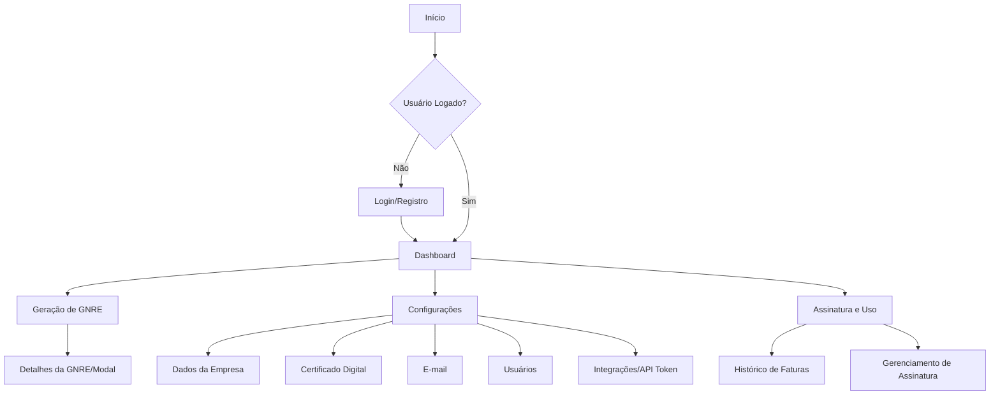

# Planejamento Detalhado do Frontend da Aplicação de Geração de GNRE

## 2. Frontend (Portal Web)

O Frontend será uma Single Page Application (SPA) reativa e moderna, focada na experiência do usuário, com ênfase em segurança e performance.

### 2.1. Stack Tecnológica Consolidada

*   **Framework:** `React 18.3.1` com `Next.js 14+ (App Router)` para renderização híbrida (SSR para páginas públicas/SEO, CSR para dashboard interativo). A escolha do Next.js, embora não explicitamente mencionada no `FRONT.md`, é uma recomendação forte dos outros agentes (`Claude`, `GEMINI`, `OpenAI`) para otimização de performance e segurança (CSP headers automáticos).
*   **Linguagem:** `TypeScript 5.5.3` para tipagem estática e segurança de código.
*   **Estilização:** `Tailwind CSS 3.4.1` para desenvolvimento rápido e consistente de UI, complementado por `Shadcn UI` ou `Tremor React 3.14.1` para componentes de dashboard e analytics. A preferência do `FRONT.md` por `Tremor React` é mantida, mas `Shadcn UI` pode ser considerado para componentes mais genéricos.
*   **Gerenciamento de Estado:** `Zustand` (conforme `Claude` e `GEMINI`) ou `Context API` (conforme `FRONT.md`). A recomendação é iniciar com `Context API` para estados mais simples e migrar para `Zustand` ou `Redux Toolkit` se a complexidade do estado global aumentar, priorizando a simplicidade inicial.
*   **Formulários:** `React Hook Form` com `Zod` (validação) para gerenciamento e validação robusta de formulários.
*   **Comunicação com API:** `Axios` ou `TanStack Query (React Query)` para data fetching, cache e sincronização. `TanStack Query` é preferível para otimização de performance e experiência do desenvolvedor.
*   **Roteamento:** `React Router DOM 6.22.3` para roteamento client-side, com `Protected Routes Pattern`.
*   **Build Tools:** `Vite 6.3.5` para desenvolvimento rápido e `esbuild`/`Rollup`/`SWC` para otimização de produção.

### 2.2. Funcionalidades Principais

*   **Login e Autenticação:**
    *   Fluxo de login com e-mail/senha, recuperação de senha.
    *   Autenticação baseada em `JWT` com `refresh tokens` (armazenados em `HttpOnly`, `Secure`, `SameSite=Strict` cookies para segurança máxima).
    *   `Middleware` de proteção de rotas.
    *   Implementação de `MFA` (Multi-Factor Authentication) como TOTP, SMS, e-mail (conforme `Claude`).
    *   Políticas de senha robustas (mínimo 12 caracteres, complexidade, rotação).
    *   `Rate limiting` e bloqueio de tentativas de `brute-force`.
*   **Dashboard:**
    *   Visão geral com KPIs (GNREs geradas, pendentes, valor total).
    *   Gráficos de uso mensal/semanal.
    *   Alertas de vencimento de certificados ou GNREs.
*   **Tela de Geração de GNRE:**
    *   `UploadZone` (drag & drop) para múltiplos XMLs com validação de formato e tamanho.
    *   `GNRETable` com virtualização para grandes volumes, filtros, paginação, seleção múltipla.
    *   Ações por item (Gerar PDF, Impressão, Recálculo, Exclusão) e ações em lote.
    *   Exportação para layout bancário (`.rem`).
*   **Tela de Configurações:**
    *   Dados da Empresa (CNPJ, Razão Social, Endereço).
    *   `Upload` e gerenciamento de Certificado Digital (`.pfx`, `.p12`) com indicação de validade.
    *   Configurações de E-mail (SMTP).
    *   Gerenciamento de Usuários (CRUD, papéis).
    *   Geração e cópia de `Token da API` para aplicação local.
*   **Tela de Assinatura e Uso:**
    *   Integração com gateway de pagamento (Stripe/Pagar.me).
    *   Exibição do plano atual e medidor de uso.
    *   Histórico de faturas.

### 2.3. Foco em Segurança (Frontend)

*   **Prevenção de XSS:** Uso de React para `escape` automático de strings. Proibição de `dangerouslySetInnerHTML` e uso de `DOMPurify` para sanitização de inputs.
*   **Prevenção de CSRF:** Armazenamento de `JWT` em `HttpOnly`, `Secure`, `SameSite=Strict` cookies. Implementação de `CSRF tokens` em requisições POST/PUT/DELETE.
*   **Content Security Policy (CSP):** Configuração rigorosa no Next.js para limitar fontes de conteúdo.
*   **Segurança de Dependências:** Verificação automática de vulnerabilidades (`npm audit`, `Snyk`) no CI/CD.
*   **Validação Client-Side Robusta:** Uso de `Zod` para validação de schemas, complementando a validação de backend.
*   **Gerenciamento Seguro de Estado:** Criptografia de dados sensíveis em memória (`Zustand` com `CryptoJS`) para tokens e certificados.

### 3. Agente 3 – UX/UI Designer: Plano Detalhado

**Objetivo:** Criar design system, wireframes, layouts modernos e minimalistas, considerando Dark Mode, responsividade e usabilidade para a aplicação GNRE.

#### 3.1. Análise de Documentos (Requisitos + Arquitetura)

*   **Revisão Aprofundada:** Reanalisar o [`Planejamento_Detalhado_GNRE.md`](Planejamento_Detalhado_GNRE.md) para garantir que todos os fluxos de usuário, pontos de entrada e telas prioritárias (Login/Registro, Dashboard, Geração de GNRE, Configurações, Assinatura e Uso) sejam compreendidos em detalhes.
*   **Impacto da Segurança na UX:** Considerar como funcionalidades de segurança (MFA, políticas de senha, feedback de erros de autenticação, logs de auditoria) serão apresentadas ao usuário de forma clara e intuitiva.

#### 3.2. Design System (Base: Tailwind CSS, SHADCN/UI ou Tremor React)

O design system será a base para a consistência visual e funcional da aplicação.

*   **Paleta de Cores:**
    *   **Primárias:** Definir uma cor principal que represente a marca (ex: um tom de azul ou verde corporativo).
    *   **Secundárias:** Cores complementares para elementos de destaque.
    *   **Acento:** Cores para interações (botões de ação, links).
    *   **Status:** Cores para sucesso (verde), aviso (amarelo/laranja), erro (vermelho) e informação (azul claro).
    *   **Modo Escuro (Dark Mode):** Criar uma paleta correspondente para o modo escuro, garantindo contraste e legibilidade. As cores de fundo serão mais escuras, e as cores de texto e elementos, mais claras.
*   **Tipografia:**
    *   **Fontes:** Escolher uma família de fontes moderna e legível (ex: Inter, Poppins, Roboto).
    *   **Hierarquia:** Definir tamanhos e pesos para títulos (H1-H6), subtítulos, corpo de texto, legendas e elementos de UI, garantindo clareza e hierarquia visual.
*   **Ícones:**
    *   **Biblioteca:** Utilizar `Lucide React` para ícones, garantindo consistência e fácil integração.
    *   **Estilo:** Definir um estilo de ícones (outline, filled) e tamanhos padrão.
*   **Componentes Básicos (Inspirados em SHADCN/UI, Tremor React e inspirações do 21st MCP):**
    *   **Botões:**
        *   Tipos: Primário, Secundário, Perigo, Link, Ícone.
        *   Estados: Normal, Hover, Foco, Ativo, Desabilitado, Loading.
        *   Tamanhos: Pequeno, Médio, Grande.
    *   **Formulários:**
        *   Inputs: Texto, Número, E-mail, Senha, Textarea.
        *   Seletores: Checkboxes, Radio Buttons, Selects (Dropdowns), Date Pickers.
        *   Validação: Estados de erro, mensagens de feedback.
    *   **Modais e Dialogs:** Para confirmações, formulários complexos e exibições de detalhes.
    *   **Toasts e Notificações:** Para feedback rápido ao usuário (sucesso, erro, aviso).
    *   **Badges e Tags de Status:** Para indicar o status de GNREs (Pendente, Processando, Gerado, Pago, Cancelado, Erro) e outros elementos.
    *   **Tabelas:**
        *   Funcionalidades: Paginação, filtros (por status, data, nome do cliente), ordenação de colunas, seleção de linhas, ações por linha (download PDF, visualizar detalhes).
        *   Design: Linhas zebradas, cabeçalhos fixos, responsividade.
    *   **Cards e Painéis:** Para organizar informações no Dashboard e em outras telas.
        *   *Inspiração:* Os componentes "Stats Section" e "Stats" do 21st MCP são excelentes exemplos de como exibir KPIs em cards, com indicadores de mudança e descrições claras. Serão adaptados para exibir métricas como "GNREs Geradas no Mês", "Valor Total Processado", "GNREs Pendentes", etc.
    *   **Loaders e Spinners:** Para indicar estados de carregamento.
    *   **Navegação (Sidebar/Header):
        *   *Inspiração:* O componente "Toggle nav" do 21st MCP pode ser adaptado para a barra lateral de navegação, permitindo que o usuário a recolha ou expanda, otimizando o espaço da tela.
        *   Elementos: Links de navegação, ícones, indicadores de notificação, avatar do usuário.
*   **Guia de Estilo:** Documentar todos os componentes, diretrizes de uso, exemplos de código e princípios de design para garantir a adesão da equipe de desenvolvimento.

#### 3.3. Layouts e Wireframes (Protótipos Interativos)

Serão criados protótipos de alta fidelidade no Figma (ou ferramenta similar), com foco em responsividade e acessibilidade.

*   **Fluxo de Autenticação:**
    *   **Login:** Tela simples e limpa com campos de e-mail/usuário e senha, opção "Esqueci a senha", e link para registro.
    *   **Registro:** Formulário para criação de conta (nome, e-mail, senha, confirmação de senha, nome da empresa, CNPJ).
    *   **Recuperação de Senha:** Fluxo de duas etapas (e-mail para redefinição, tela de nova senha).
    *   **MFA:** Tela para inserção de código de autenticação.
*   **Dashboard:**
    *   **Layout:** Visão geral com cards de KPIs (inspirados nos componentes "Stats Section" e "Stats"), gráficos de tendências (GNREs geradas por período, valor total), e um resumo das últimas GNREs ou lotes.
    *   **Elementos:** Header com navegação principal, sidebar (adaptada do "Toggle nav"), área de conteúdo.
*   **Tela de Geração de GNRE:**
    *   **Upload:** Área de drag & drop para XMLs, com feedback visual de upload e validação.
    *   **Tabela de GNREs:** Exibição das GNREs com colunas configuráveis (Nº NFe, Cliente, UF, Vencimento, Valor, Status, Protocolo), filtros avançados, paginação e ordenação.
    *   **Modais de Ação:** Modais para visualizar detalhes da GNRE, editar informações, baixar PDF, cancelar.
*   **Tela de Configurações:**
    *   **Abas:** Navegação por abas para:
        *   **Dados da Empresa:** Formulário para editar informações da empresa.
        *   **Certificado Digital:** Área para upload seguro, visualização de validade e status do certificado.
        *   **E-mail:** Configurações de notificação por e-mail.
        *   **Usuários:** Gerenciamento de usuários da empresa (adicionar, editar, remover, gerenciar papéis).
        *   **Integrações:** Exibição e geração de `API Token` para a aplicação local.
*   **Tela de Assinatura e Uso:**
    *   **Detalhes do Plano:** Exibição do plano atual, data de renovação, funcionalidades inclusas.
    *   **Medidor de Uso:** Gráfico ou barra de progresso mostrando o consumo de GNREs geradas no período.
    *   **Histórico de Faturas:** Tabela com faturas anteriores e opção de download.
    *   **Gerenciamento de Assinatura:** Botões para upgrade/downgrade de plano, cancelamento.
*   **Layout Responsivo:**
    *   **Abordagem Mobile-First:** Projetar primeiro para telas menores e depois adaptar para tablets e desktops.
    *   **Breakpoints:** Definir breakpoints para garantir que o layout se ajuste fluidamente a diferentes tamanhos de tela.
*   **Guidelines de Acessibilidade (WCAG 2.1 AA):**
    *   **Cores e Contraste:** Garantir contraste suficiente entre texto e fundo.
    *   **Navegação por Teclado:** Todos os elementos interativos devem ser acessíveis via teclado.
    *   **Leitores de Tela:** Utilizar atributos `aria-label`, `alt text` para imagens e estrutura semântica HTML.
    *   **Estados de Foco:** Indicar claramente o elemento focado.

#### 3.4. Documentação Final de UX/UI

*   **Entrega:**
    *   Link para o protótipo interativo no Figma (ou ferramenta similar).
    *   Documento detalhado do Design System (incluindo paleta de cores, tipografia, ícones, e especificações de todos os componentes).
    *   Wireframes e fluxos de usuário em formato visual.

**Artefato de Saída:** Documento/Protótipo de UX/UI + arquivos do design system (se gerados programaticamente ou mocks).

---

**Diagrama de Fluxo de Telas (Mermaid):**



## 4. Agente 4 – Desenvolvedor(a) Front-end

**Objetivo:** Implementar a camada visual do projeto (React 18.x.x, Next.js 15.x.x), seguindo o design system e suportando i18n, SSR, NextAuth, Stripe e outras integrações.

**Task List / To-Do:**

*   **4.1. Analisar Documentos (Discovery, Arquitetura e UX/UI):**
    *   [ ] Revisar o `Planejamento_Detalhado_GNRE.md` e os artefatos de UX/UI.
    *   [ ] Entender rotas específicas, regras de cache, e necessidades de SSR/CSR.

*   **4.2. Configuração Inicial do Projeto:**
    *   [ ] Inicializar projeto Next.js com TypeScript.
    *   [ ] Configurar estrutura de pastas (`app/`, `components/`, `hooks/`, `services/`, `store/`, `types/`, `utils/`).
    *   [ ] Instalar dependências: `React` (18.x.x), `Next.js` (15.x.x), `TypeScript` (5.x.x), `Tailwind CSS` (3.x.x), `Shadcn UI` (0.9.0), `Tremor React` (1.0.0), `React Hook Form` (7.x.x), `Zod` (3.25.29), `TanStack Query` (5.x.x), `React Router DOM` (6.x.x), `Lucide React` (0.395.0).
    *   [ ] Configurar `Vite` (5.x.x) para desenvolvimento e otimizações de build (`esbuild`, `Rollup`, `SWC`).
    *   [ ] Configurar `ESLint` (8.x.x ou 9.x.x) e `TypeScript ESLint` (7.x.x) para qualidade de código.

*   **4.3. Implementação de Componentes e Páginas:**
    *   [ ] **Layout Base:**
        *   [ ] Implementar `Layout.tsx` com `Header`, `Footer`, `Sidebar`.
        *   [ ] Configurar `Dark Mode` switcher.
    *   [ ] **Sistema de Autenticação:**
        *   [ ] Desenvolver `Login.tsx` e `Register.tsx`.
        *   [ ] Implementar `AuthContext.tsx` (ou `Zustand store`) para gerenciamento de estado de autenticação.
        *   [ ] Criar `ProtectedRoute.tsx` para proteção de rotas.
        *   [ ] Integrar com endpoints de autenticação do Backend.
        *   [ ] Implementar `MFA` (Multi-Factor Authentication) no fluxo de login.
    *   [ ] **Dashboard:**
        *   [ ] Desenvolver `Dashboard.tsx` com integração de dados reais.
        *   [ ] Implementar gráficos com `Tremor React Charts`.
        *   [ ] Exibir KPIs e alertas.
    *   [ ] **Tela de Geração de GNRE (`GnreList.tsx`):**
        *   [ ] Implementar `UploadZone` (drag & drop).
        *   [ ] Desenvolver `DataTable.tsx` com funcionalidades completas (filtros, paginação, ordenação, seleção, ações).
        *   [ ] Criar modais para ações (edição, exportação).
        *   [ ] Implementar `StatusBadge.tsx`.
    *   [ ] **Tela de Configurações (`Settings.tsx`):**
        *   [ ] Formulários para Dados da Empresa.
        *   [ ] Componente de `Upload` e gerenciamento de Certificado Digital.
        *   [ ] Configurações de E-mail.
        *   [ ] Gerenciamento de Usuários (se aplicável ao frontend).
        *   [ ] Exibição e cópia do `Token da API`.
    *   [ ] **Tela de Assinatura e Uso:**
        *   [ ] Implementar exibição do plano e medidor de uso.
        *   [ ] Integrar com gateway de pagamento (Stripe/Pagar.me) para gerenciamento de assinatura.

*   **4.4. Integrações Específicas:**
    *   [ ] **Autenticação:** Integrar com `NextAuth.js` (4.x.x) (se a escolha for Next.js) ou implementar autenticação JWT customizada.
    *   [ ] **Stripe:** Implementar páginas de checkout e gerenciamento de assinatura.
    *   [ ] **i18n:** Configurar internacionalização (PT, EN, ES, FR, DE).

*   **4.5. SSR e Otimizações:**
    *   [ ] Aplicar `SSR` em páginas públicas e `CSR` em páginas autenticadas.
    *   [ ] Implementar `Lazy Loading` e `Code Splitting` para otimização de bundle.
    *   [ ] Otimizar imagens e assets.
    *   [ ] Configurar `TanStack Query` para cache e revalidação de dados.

*   **4.6. Foco em Segurança (Frontend):**
    *   [ ] Garantir `escape` automático de strings no React.
    *   [ ] Utilizar `DOMPurify` para sanitização de inputs.
    *   [ ] Armazenar `JWT` em `HttpOnly`, `Secure`, `SameSite=Strict` cookies.
    *   [ ] Implementar `CSRF tokens` em requisições POST/PUT/DELETE.
    *   [ ] Configurar `Content Security Policy (CSP)` rigorosa no Next.js.
    *   [ ] Validar formatos e tamanhos de arquivos antes do upload.
    *   [ ] Criptografar dados sensíveis em memória (`Zustand` com `CryptoJS`).

**Artefato de Saída:** Código fonte do Frontend.

## 7. Velocidade e Escalabilidade (Frontend)

*   `Lazy Loading` e `Code Splitting` para carregamento rápido.
*   `SSR/CSR` otimizado com Next.js.
*   `Vite` para desenvolvimento rápido e `esbuild` para builds de produção.
*   `TanStack Query` para cache e sincronização de dados.
*   Virtualização de tabelas (`TanStack Table` com `TanStack Virtual`) para grandes volumes de dados.

## 9. Justificativas para Divergências (Frontend)

*   **Frontend (React/Vite/Context API vs Next.js/Zustand/Shadcn):**
    *   **Sua escolha (`FRONT.md`):** React 18.3.1, TypeScript 5.5.3, Vite 6.3.5, Context API, Tailwind CSS, Tremor React.
    *   **Outras sugestões:** Next.js 14+, Shadcn/ui, Zustand, Tanstack Query (`Claude`, `GEMINI`, `OpenAI`).
    *   **Justificativa:** A base do seu `FRONT.md` é **excelente e moderna**. A sugestão de incorporar `Next.js` é para aproveitar recursos como `SSR/SSG` (melhor SEO para páginas públicas, carregamento inicial mais rápido), `App Router` (melhor organização de rotas e data fetching) e `CSP headers` automáticos, que são cruciais para segurança e performance em aplicações corporativas. `Shadcn UI` é uma biblioteca de componentes headless que se integra perfeitamente com `Tailwind CSS` e oferece alta customização, sendo uma alternativa robusta ao `Tremor React` para componentes mais genéricos, enquanto `Tremor` pode ser mantido para dashboards específicos. `Zustand` é uma biblioteca de gerenciamento de estado leve e performática, uma boa evolução da `Context API` para estados mais complexos. `Tanstack Query` é um padrão de mercado para data fetching e cache. A recomendação é **integrar esses elementos** para elevar o nível do frontend, mantendo a base sólida que você já definiu.
## 🎨 Governança do Design System

### 5.1. Storybook Implementation
```javascript
// .storybook/main.js
module.exports = {
  stories: ['../src/**/*.stories.@(js|jsx|ts|tsx)'],
  addons: [
    '@storybook/addon-essentials',
    '@storybook/addon-a11y',
    '@storybook/addon-design-tokens',
    '@storybook/addon-docs',
    '@storybook/addon-controls'
  ],
  framework: {
    name: '@storybook/nextjs',
    options: {}
  }
};

// src/components/GNREStatusBadge/GNREStatusBadge.stories.tsx
import type { Meta, StoryObj } from '@storybook/react';
import { GNREStatusBadge } from './GNREStatusBadge';

const meta: Meta<typeof GNREStatusBadge> = {
  title: 'Components/GNREStatusBadge',
  component: GNREStatusBadge,
  parameters: {
    docs: {
      description: {
        component: 'Badge para exibir status das GNREs com cores semânticas'
      }
    }
  },
  argTypes: {
    status: {
      control: { type: 'select' },
      options: ['PENDENTE', 'PROCESSANDO', 'GERADO', 'PAGO', 'CANCELADO', 'ERRO'],
      description: 'Status atual da GNRE'
    },
    size: {
      control: { type: 'select' },
      options: ['sm', 'md', 'lg'],
      description: 'Tamanho do badge'
    }
  }
};

export default meta;
type Story = StoryObj<typeof GNREStatusBadge>;

export const Default: Story = {
  args: {
    status: 'PENDENTE',
    size: 'md'
  }
};

export const AllStatuses: Story = {
  render: () => (
    <div className="flex gap-2 flex-wrap">
      {['PENDENTE', 'PROCESSANDO', 'GERADO', 'PAGO', 'CANCELADO', 'ERRO'].map(status => (
        <GNREStatusBadge key={status} status={status} size="md" />
      ))}
    </div>
  )
};
```

### 5.2. Design Tokens
```typescript
// src/design-system/tokens.ts
export const designTokens = {
  colors: {
    primary: {
      50: '#eff6ff',
      500: '#3b82f6',
      900: '#1e3a8a'
    },
    status: {
      pending: '#f59e0b',
      processing: '#3b82f6',
      generated: '#10b981',
      paid: '#059669',
      cancelled: '#6b7280',
      error: '#ef4444'
    }
  },
  spacing: {
    xs: '0.25rem',
    sm: '0.5rem',
    md: '1rem',
    lg: '1.5rem',
    xl: '2rem'
  },
  typography: {
    fontFamily: {
      sans: ['Inter', 'system-ui', 'sans-serif'],
      mono: ['JetBrains Mono', 'monospace']
    },
    fontSize: {
      xs: ['0.75rem', { lineHeight: '1rem' }],
      sm: ['0.875rem', { lineHeight: '1.25rem' }],
      base: ['1rem', { lineHeight: '1.5rem' }],
      lg: ['1.125rem', { lineHeight: '1.75rem' }]
    }
  }
} as const;
```

## 🚀 Estratégia de Cache e Performance

### 6.1. TanStack Query Configuration
```typescript
// src/lib/query-client.ts
import { QueryClient } from '@tanstack/react-query';

export const queryClient = new QueryClient({
  defaultOptions: {
    queries: {
      staleTime: 5 * 60 * 1000, // 5 minutos
      cacheTime: 10 * 60 * 1000, // 10 minutos
      retry: (failureCount, error) => {
        // Não retry em erros 4xx
        if (error?.status >= 400 && error?.status < 500) {
          return false;
        }
        return failureCount < 3;
      },
      refetchOnWindowFocus: true,
      refetchOnMount: true,
      refetchOnReconnect: true
    },
    mutations: {
      retry: 1
    }
  }
});

// src/hooks/useGNREs.ts
import { useQuery, useMutation, useQueryClient } from '@tanstack/react-query';
import { gnreApi } from '@/services/api';

export function useGNREs(filters?: GNREFilters) {
  return useQuery({
    queryKey: ['gnres', filters],
    queryFn: () => gnreApi.list(filters),
    staleTime: 2 * 60 * 1000, // 2 minutos para dados dinâmicos
    select: (data) => ({
      ...data,
      items: data.items.map(gnre => ({
        ...gnre,
        formattedAmount: new Intl.NumberFormat('pt-BR', {
          style: 'currency',
          currency: 'BRL'
        }).format(gnre.amount)
      }))
    })
  });
}

export function useCreateGNRE() {
  const queryClient = useQueryClient();

  return useMutation({
    mutationFn: gnreApi.create,
    onSuccess: () => {
      // Invalidar cache de listagem
      queryClient.invalidateQueries({ queryKey: ['gnres'] });
      // Invalidar dashboard stats
      queryClient.invalidateQueries({ queryKey: ['dashboard', 'stats'] });
    },
    onError: (error) => {
      // Log error para observabilidade
      console.error('Failed to create GNRE:', error);
    }
  });
}
```

### 6.2. Otimização de Assets
```typescript
// next.config.js
/** @type {import('next').NextConfig} */
const nextConfig = {
  experimental: {
    optimizeCss: true,
    optimizePackageImports: ['@tremor/react', 'lucide-react']
  },
  images: {
    formats: ['image/avif', 'image/webp'],
    deviceSizes: [640, 750, 828, 1080, 1200, 1920, 2048, 3840],
    imageSizes: [16, 32, 48, 64, 96, 128, 256, 384]
  },
  compiler: {
    removeConsole: process.env.NODE_ENV === 'production'
  },
  async headers() {
    return [
      {
        source: '/fonts/(.*)',
        headers: [
          {
            key: 'Cache-Control',
            value: 'public, max-age=31536000, immutable'
          }
        ]
      }
    ];
  }
};

module.exports = nextConfig;

// src/app/layout.tsx
import { Inter } from 'next/font/google';

const inter = Inter({
  subsets: ['latin'],
  display: 'swap',
  variable: '--font-inter'
});

export default function RootLayout({
  children
}: {
  children: React.ReactNode;
}) {
  return (
    <html lang="pt-BR" className={inter.variable}>
      <head>
        <link
          rel="preload"
          href="/fonts/inter-var.woff2"
          as="font"
          type="font/woff2"
          crossOrigin="anonymous"
        />
      </head>
      <body className="font-sans antialiased">
        {children}
      </body>
    </html>
  );
}
```

## 🧪 Estratégia de Testes Avançada

### 7.1. Configuração de Testes
```typescript
// jest.config.js
const nextJest = require('next/jest');

const createJestConfig = nextJest({
  dir: './'
});

const customJestConfig = {
  setupFilesAfterEnv: ['<rootDir>/jest.setup.js'],
  testEnvironment: 'jest-environment-jsdom',
  collectCoverageFrom: [
    'src/**/*.{js,jsx,ts,tsx}',
    '!src/**/*.d.ts',
    '!src/**/*.stories.{js,jsx,ts,tsx}',
    '!src/app/layout.tsx'
  ],
  coverageThreshold: {
    global: {
      branches: 80,
      functions: 80,
      lines: 80,
      statements: 80
    }
  },
  moduleNameMapping: {
    '^@/(.*)$': '<rootDir>/src/$1'
  }
};

module.exports = createJestConfig(customJestConfig);

// jest.setup.js
import '@testing-library/jest-dom';
import { server } from './src/mocks/server';

beforeAll(() => server.listen());
afterEach(() => server.resetHandlers());
afterAll(() => server.close());
```

### 7.2. Testes de Componentes
```typescript
// src/components/GNRETable/GNRETable.test.tsx
import { render, screen, waitFor } from '@testing-library/react';
import userEvent from '@testing-library/user-event';
import { QueryClient, QueryClientProvider } from '@tanstack/react-query';
import { GNRETable } from './GNRETable';
import { mockGNREs } from '@/mocks/data';

const createTestQueryClient = () => new QueryClient({
  defaultOptions: {
    queries: { retry: false },
    mutations: { retry: false }
  }
});

const renderWithProviders = (ui: React.ReactElement) => {
  const queryClient = createTestQueryClient();
  return render(
    <QueryClientProvider client={queryClient}>
      {ui}
    </QueryClientProvider>
  );
};

describe('GNRETable', () => {
  it('should render GNRE list correctly', async () => {
    renderWithProviders(<GNRETable />);

    await waitFor(() => {
      expect(screen.getByText('Lista de GNREs')).toBeInTheDocument();
    });

    // Verificar se os dados mockados aparecem
    expect(screen.getByText(mockGNREs[0].client_name)).toBeInTheDocument();
    expect(screen.getByText('R$ 150,00')).toBeInTheDocument();
  });

  it('should filter GNREs by status', async () => {
    const user = userEvent.setup();
    renderWithProviders(<GNRETable />);

    // Abrir filtro de status
    await user.click(screen.getByRole('button', { name: /filtrar por status/i }));

    // Selecionar apenas "GERADO"
    await user.click(screen.getByRole('checkbox', { name: /gerado/i }));

    // Verificar se apenas GNREs com status GERADO aparecem
    await waitFor(() => {
      const statusBadges = screen.getAllByTestId('gnre-status-badge');
      statusBadges.forEach(badge => {
        expect(badge).toHaveTextContent('GERADO');
      });
    });
  });

  it('should handle download PDF action', async () => {
    const user = userEvent.setup();
    renderWithProviders(<GNRETable />);

    // Clicar no botão de download da primeira GNRE
    await user.click(screen.getAllByRole('button', { name: /download pdf/i })[0]);

    // Verificar se o download foi iniciado
    await waitFor(() => {
      expect(screen.getByText(/download iniciado/i)).toBeInTheDocument();
    });
  });
});
```

### 7.3. Testes E2E com Playwright
```typescript
// e2e/gnre-workflow.spec.ts
import { test, expect } from '@playwright/test';

test.describe('GNRE Workflow', () => {
  test.beforeEach(async ({ page }) => {
    // Login
    await page.goto('/login');
    await page.fill('[data-testid="email-input"]', 'test@example.com');
    await page.fill('[data-testid="password-input"]', 'password123');
    await page.click('[data-testid="login-button"]');

    // Aguardar redirecionamento para dashboard
    await expect(page).toHaveURL('/dashboard');
  });

  test('should complete full GNRE generation workflow', async ({ page }) => {
    // Navegar para geração de GNRE
    await page.click('[data-testid="nav-gnre-generation"]');
    await expect(page).toHaveURL('/gnre');

    // Upload de XML
    const fileInput = page.locator('input[type="file"]');
    await fileInput.setInputFiles('e2e/fixtures/sample-nfe.xml');

    // Aguardar processamento
    await expect(page.locator('[data-testid="processing-indicator"]')).toBeVisible();
    await expect(page.locator('[data-testid="processing-indicator"]')).toBeHidden({ timeout: 30000 });

    // Verificar se GNRE apareceu na tabela
    await expect(page.locator('[data-testid="gnre-table"]')).toContainText('PROCESSANDO');

    // Aguardar geração completa
    await page.waitForTimeout(5000);
    await page.reload();

    // Verificar status final
    await expect(page.locator('[data-testid="gnre-table"]')).toContainText('GERADO');

    // Download PDF
    await page.click('[data-testid="download-pdf-button"]');

    // Verificar se download foi iniciado
    const downloadPromise = page.waitForEvent('download');
    const download = await downloadPromise;
    expect(download.suggestedFilename()).toMatch(/\.pdf$/);
  });

  test('should handle upload errors gracefully', async ({ page }) => {
    await page.goto('/gnre');

    // Upload arquivo inválido
    const fileInput = page.locator('input[type="file"]');
    await fileInput.setInputFiles('e2e/fixtures/invalid-file.txt');

    // Verificar mensagem de erro
    await expect(page.locator('[data-testid="error-toast"]')).toContainText('Formato de arquivo inválido');
  });
});
```

## 📊 Observabilidade Frontend

### 8.1. Error Boundary com Logging
```typescript
// src/components/ErrorBoundary.tsx
'use client';

import React from 'react';
import * as Sentry from '@sentry/nextjs';

interface ErrorBoundaryState {
  hasError: boolean;
  error?: Error;
}

export class ErrorBoundary extends React.Component<
  React.PropsWithChildren<{}>,
  ErrorBoundaryState
> {
  constructor(props: React.PropsWithChildren<{}>) {
    super(props);
    this.state = { hasError: false };
  }

  static getDerivedStateFromError(error: Error): ErrorBoundaryState {
    return { hasError: true, error };
  }

  componentDidCatch(error: Error, errorInfo: React.ErrorInfo) {
    // Log para Sentry
    Sentry.captureException(error, {
      contexts: {
        react: {
          componentStack: errorInfo.componentStack
        }
      }
    });

    // Log estruturado
    console.error('React Error Boundary caught an error:', {
      error: error.message,
      stack: error.stack,
      componentStack: errorInfo.componentStack,
      timestamp: new Date().toISOString()
    });
  }

  render() {
    if (this.state.hasError) {
      return (
        <div className="min-h-screen flex items-center justify-center bg-gray-50">
          <div className="max-w-md w-full bg-white shadow-lg rounded-lg p-6">
            <div className="flex items-center mb-4">
              <div className="flex-shrink-0">
                <svg className="h-8 w-8 text-red-400" fill="none" viewBox="0 0 24 24" stroke="currentColor">
                  <path strokeLinecap="round" strokeLinejoin="round" strokeWidth={2} d="M12 9v2m0 4h.01m-6.938 4h13.856c1.54 0 2.502-1.667 1.732-2.5L13.732 4c-.77-.833-1.732-.833-2.5 0L4.268 18.5c-.77.833.192 2.5 1.732 2.5z" />
                </svg>
              </div>
              <div className="ml-3">
                <h3 className="text-sm font-medium text-gray-800">
                  Algo deu errado
                </h3>
              </div>
            </div>
            <div className="text-sm text-gray-600 mb-4">
              Ocorreu um erro inesperado. Nossa equipe foi notificada e está trabalhando para resolver o problema.
            </div>
            <button
              onClick={() => window.location.reload()}
              className="w-full bg-blue-600 text-white py-2 px-4 rounded-md hover:bg-blue-700 transition-colors"
            >
              Recarregar Página
            </button>
          </div>
        </div>
      );
    }

    return this.props.children;
  }
}
```

### 8.2. Performance Monitoring
```typescript
// src/lib/performance.ts
import { getCLS, getFID, getFCP, getLCP, getTTFB } from 'web-vitals';

function sendToAnalytics(metric: any) {
  // Enviar para serviço de analytics
  if (typeof window !== 'undefined' && window.gtag) {
    window.gtag('event', metric.name, {
      event_category: 'Web Vitals',
      event_label: metric.id,
      value: Math.round(metric.name === 'CLS' ? metric.value * 1000 : metric.value),
      non_interaction: true
    });
  }

  // Log estruturado
  console.log('Web Vital:', {
    name: metric.name,
    value: metric.value,
    id: metric.id,
    timestamp: Date.now()
  });
}

export function initPerformanceMonitoring() {
  getCLS(sendToAnalytics);
  getFID(sendToAnalytics);
  getFCP(sendToAnalytics);
  getLCP(sendToAnalytics);
  getTTFB(sendToAnalytics);
}
```

---

*Este documento é atualizado com cada release do frontend e revisado pela equipe de desenvolvimento.*