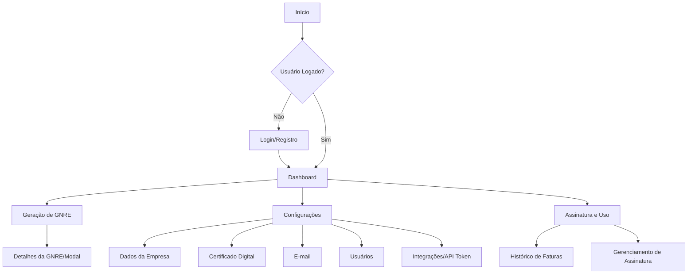

# Planejamento Detalhado da Aplicação de Geração de GNRE por Agente

## 📋 Cronograma e Marcos

| Fase | Agente | Duração Estimada | Dependências | Marco |
|------|--------|------------------|--------------|-------|
| 0 | Validação de Mercado | 2-3 semanas | - | MVP Validado |
| 1 | Discovery Master | 1 semana | Fase 0 | Requisitos Consolidados |
| 2 | Arquiteto de Software | 2 semanas | Fase 1 | Arquitetura Definida |
| 3 | UX/UI Designer | 3 semanas | Fase 2 | Design System + Protótipos |
| 4-5 | Desenvolvimento | 8-10 semanas | Fase 3 | MVP Técnico |
| 6-7 | Infraestrutura + Segurança | 2 semanas | Paralelo 4-5 | Ambiente Produção |
| 8 | Testes | 2 semanas | Fase 4-5 | Qualidade Validada |
| 9-10 | Validação + Observabilidade | 1 semana | Fase 8 | Produto Pronto |
| 11 | Deploy Final | 1 semana | Todas | Go-Live |

**Total Estimado: 20-24 semanas**

## 0. Agente 0 – Validação de Mercado e Produto

**Objetivo:** Validar viabilidade do produto e definir estratégia de mercado antes do desenvolvimento técnico.

**Task List / To-Do:**

*   **0.1. Pesquisa de Mercado:**
    *   [ ] Entrevistar 10-15 contadores/empresas sobre dores atuais com GNRE
    *   [ ] Mapear soluções concorrentes (preços, funcionalidades, pontos fracos)
    *   [ ] Identificar diferencial competitivo e proposta de valor única
    *   [ ] Validar disposição de pagamento e faixas de preço aceitáveis

*   **0.2. Definição de Personas e Jornada do Usuário:**
    *   [ ] Criar personas detalhadas (contador, empresário, assistente fiscal)
    *   [ ] Mapear jornada atual do usuário (como fazem GNRE hoje)
    *   [ ] Identificar pontos de dor e oportunidades de melhoria
    *   [ ] Definir jobs-to-be-done para cada persona

*   **0.3. Validação do Modelo de Negócio:**
    *   [ ] Testar diferentes modelos de precificação (por GNRE, mensal, anual)
    *   [ ] Validar canais de distribuição (direto, parceiros, marketplace)
    *   [ ] Estimar custos de aquisição de cliente (CAC) e lifetime value (LTV)
    *   [ ] Definir estratégia de go-to-market

*   **0.4. MVP e Testes de Usabilidade:**
    *   [ ] Criar protótipo navegável (Figma/InVision) com fluxos principais
    *   [ ] Realizar testes de usabilidade com 5-8 usuários reais
    *   [ ] Iterar design baseado no feedback
    *   [ ] Validar funcionalidades essenciais vs. nice-to-have

**Artefato de Saída:** Relatório de Validação de Mercado + Personas + Modelo de Negócio Validado

## 1. Agente 1 – Discovery Master (Concluído)

**Objetivo:** Levantar todos os dados e requisitos do projeto para enviar às próximas etapas.

Esta fase foi concluída com a entrega dos briefings iniciais e dos documentos de requisitos consolidados pelos diferentes "agentes" (Claude, Gemini, Grok, OpenAI), bem como as especificações de Frontend, Backend e Aplicação Local.

**Artefatos de Saída (já fornecidos):**
*   Briefing inicial e rascunho de perguntas.
*   Documento de Requisitos consolidado (informações dos arquivos `Claude*.md`, `GEMINI*.md`, `Grok*.md`, `OpenAI*.md`).
*   Especificações de Frontend (`FRONT.md`), Backend (`BACK.md`), e Aplicação Local (`APP.md`).

## 2. Agente 2 – Arquiteto(a) de Software (Modo Atual)

**Objetivo:** Com base no documento de requisitos do Agente 1, definir arquitetura, diagrama de dados, fluxo de APIs e padrões de desenvolvimento, com foco em segurança, velocidade e escalabilidade.

**Task List / To-Do:**

*   **2.1. Analisar Documentos de Requisitos e Especificações:**
    *   [ ] Revisar o `Planejamento_Detalhado_GNRE.md` (consolidado na etapa anterior) para garantir alinhamento com todas as necessidades funcionais e não funcionais.
    *   [ ] Validar as integrações propostas (SEFAZ, MinIO, Supabase, Gateways de Pagamento).
    *   [ ] Identificar quaisquer limitações ou dependências externas.

*   **2.2. Definir Estrutura de Projeto e Padrões:**
    *   [ ] **Decisão de Monorepo/Single Repo:** Definir se o projeto será um monorepo (ex: `Turborepo`, `Nx`) ou single repo para cada componente (Frontend, Backend, Aplicação Local).
        *   *Recomendação:* Iniciar com single repos para cada componente para simplificar o setup inicial e, se a complexidade de compartilhamento de código aumentar, migrar para monorepo.
    *   [ ] **Organização de Pastas:**
        *   [ ] **Frontend:** Definir estrutura de pastas (`src/components`, `src/pages`, `src/contexts`, `src/hooks`, `src/services`, `src/store`, `src/types`, `src/utils`).
        *   [ ] **Backend:** Definir estrutura de pastas (`src/controllers`, `src/services`, `src/repositories`, `src/middlewares`, `src/routes`, `src/utils`, `src/types`, `src/config`, `src/workers`).
        *   [ ] **Aplicação Local:** Definir estrutura de pastas (ex: `cmd/monitorxml`, `internal/config`, `internal/api`, `internal/xmlprocessor`).
    *   [ ] **Design Patterns:**
        *   [ ] **Geral:** Aplicar princípios `SOLID` e `Clean Architecture` (especialmente no Backend).
        *   [ ] **Frontend:** `Component-Based Architecture`, `Context API Pattern` (ou `Zustand`), `Protected Routes Pattern`, `Lazy Loading Pattern`.
        *   [ ] **Backend:** `MVC/Layered Architecture` (Controllers, Services, Repositories), `Dependency Injection`.
        *   [ ] **Aplicação Local:** `Modular Design`.

*   **2.3. Definir Modelos de Dados (Supabase/PostgreSQL):**
    *   [ ] **Revisar e Finalizar Schema SQL:**
        *   [ ] `companies`: `id`, `owner_id`, `name`, `cnpj`, `created_at`, `updated_at`.
        *   [ ] `users`: `id`, `email`, `password_hash`, `name`, `role`, `company_id`, `created_at`, `updated_at`.
        *   [ ] `gnres`: `id`, `company_id`, `nfe_key`, `nfe_number`, `client_name`, `uf`, `due_date`, `payment_date`, `amount`, `status`, `protocol_number`, `xml_storage_path`, `pdf_storage_path`, `created_at`, `updated_at`.
        *   [ ] `certificates`: `id`, `company_id`, `name`, `validity`, `encrypted_file_path`, `encrypted_password`, `is_active`, `created_at`.
        *   [ ] `api_tokens`: `id`, `company_id`, `token_hash`, `created_at`, `last_used_at`.
        *   [ ] `gnre_batches`: `id`, `company_id`, `status`, `sent_at`, `response_message`.
        *   [ ] `gnre_batch_items`: `gnre_id`, `batch_id` (tabela de junção).
        *   [ ] `subscriptions`: `id`, `company_id`, `gateway_customer_id`, `plan_type`, `status`, `current_period_end`.
        *   [ ] `audit_log`: `id`, `user_id`, `company_id`, `action`, `details` (JSONB), `created_at`.
    *   [ ] **Definir Enums:** `UserRole` (`ADMIN`, `USER`), `GNREStatus` (`PENDENTE`, `PROCESSANDO`, `GERADO`, `PAGO`, `CANCELADO`, `ERRO`).
    *   [ ] **Índices para Performance:**
        *   [ ] `idx_gnres_company_id` on `gnres(company_id)`.
        *   [ ] `idx_gnres_status` on `gnres(status)`.
        *   [ ] `idx_gnres_created_at` on `gnres(created_at DESC)`.
        *   [ ] `idx_gnres_compound` on `gnres(company_id, status, created_at DESC)`.
        *   [ ] `idx_gnres_cliente_gin` on `gnres` using `gin(to_tsvector('portuguese', cliente))` for full-text search.

*   **2.4. Definir Fluxo de APIs (RESTful):**
    *   [ ] **Versionamento da API:** Decidir estratégia (ex: `/api/v1/`).
    *   [ ] **Autenticação (Módulo `Auth`):**
        *   [ ] `POST /auth/login`
        *   [ ] `POST /auth/register`
        *   [ ] `POST /auth/refresh-token`
        *   [ ] `POST /auth/forgot-password`
        *   [ ] `POST /auth/reset-password`
    *   [ ] **Empresas (Módulo `Companies`):**
        *   [ ] `GET /companies/me`
        *   [ ] `PUT /companies/me`
        *   [ ] `POST /companies/me/certificate` (Upload seguro de certificado digital)
        *   [ ] `POST /companies/me/api-token` (Geração de token para aplicação local)
    *   [ ] **GNRE (Módulo `GNRE`):**
        *   [ ] `POST /gnre/process-xml` (Frontend para fila)
        *   [ ] `POST /gnre/from-local-agent` (Aplicação Local)
        *   [ ] `POST /gnre/send-batch`
        *   [ ] `GET /gnre/config/:uf`
        *   [ ] `GET /gnre/batch/:batchId`
        *   [ ] `GET /gnre/:id`
        *   [ ] `GET /gnre` (Listagem com filtros e paginação)
        *   [ ] `GET /gnre/:id/pdf` (Download PDF)
    *   [ ] **Upload/Storage:**
        *   [ ] `POST /upload/xml`
        *   [ ] `POST /upload/certificate`
        *   [ ] `GET /files/:id` (Download genérico de arquivos)

*   **2.5. Definir Fluxo de Mensageria e Cache:**
    *   [ ] **Filas de Processamento (Redis/Celery para Python):**
        *   [ ] `xml-processing-queue`: Para processamento assíncrono de XMLs.
        *   [ ] `gnre-generation-queue`: Para geração de GNREs via SEFAZ.
        *   [ ] `pdf-generation-queue`: Para geração de PDFs.
        *   [ ] `email-notifications-queue`: Para envio de e-mails transacionais.
    *   [ ] **Cache (Redis):**
        *   [ ] Configurar Redis para cache de dados frequentemente acessados (ex: configurações de UF, dados de sessão).
        *   [ ] Implementar cache de `refresh tokens`.

*   **2.6. Gerar Documentação de Arquitetura (Este Documento):**
    *   [ ] **Diagramas C4 Model:**
        *   [ ] Context Diagram (sistema e usuários externos)
        *   [ ] Container Diagram (aplicações e tecnologias)
        *   [ ] Component Diagram (componentes internos)
        *   [ ] Code Diagram (classes principais, se necessário)
    *   [ ] **Especificações de Integração:**
        *   [ ] Contratos OpenAPI para todas as APIs
        *   [ ] Documentação detalhada da integração SEFAZ (endpoints, certificados, ambientes)
        *   [ ] Especificação de webhooks e callbacks
        *   [ ] Mapeamento de códigos de erro e tratamento
    *   [ ] **Estratégias de Resiliência:**
        *   [ ] Circuit breakers para integrações externas
        *   [ ] Retry policies com backoff exponencial
        *   [ ] Fallback strategies para indisponibilidade de serviços
        *   [ ] Health checks e readiness probes
    *   [ ] **SLA/SLO Definition:**
        *   [ ] Disponibilidade: 99.5% (4h downtime/mês)
        *   [ ] Tempo de resposta: 95% < 2s, 99% < 5s
        *   [ ] Throughput: 1000 GNREs/hora por instância
        *   [ ] Recovery Time Objective (RTO): 15 minutos
        *   [ ] Recovery Point Objective (RPO): 1 hora

**Artefato de Saída:** Documento de Arquitetura Detalhado + Diagramas C4 + Contratos de API.

### 3. Agente 3 – UX/UI Designer: Plano Detalhado

**Objetivo:** Criar design system, wireframes, layouts modernos e minimalistas, considerando Dark Mode, responsividade e usabilidade para a aplicação GNRE.

#### 3.1. Análise de Documentos (Requisitos + Arquitetura)

*   **Revisão Aprofundada:** Reanalisar o [`Planejamento_Detalhado_GNRE.md`](Planejamento_Detalhado_GNRE.md) para garantir que todos os fluxos de usuário, pontos de entrada e telas prioritárias (Login/Registro, Dashboard, Geração de GNRE, Configurações, Assinatura e Uso) sejam compreendidos em detalhes.
*   **Impacto da Segurança na UX:** Considerar como funcionalidades de segurança (MFA, políticas de senha, feedback de erros de autenticação, logs de auditoria) serão apresentadas ao usuário de forma clara e intuitiva.

#### 3.2. Design System (Base: Tailwind CSS, SHADCN/UI ou Tremor React)

O design system será a base para a consistência visual e funcional da aplicação.

*   **Paleta de Cores:**
    *   **Primárias:** Definir uma cor principal que represente a marca (ex: um tom de azul ou verde corporativo).
    *   **Secundárias:** Cores complementares para elementos de destaque.
    *   **Acento:** Cores para interações (botões de ação, links).
    *   **Status:** Cores para sucesso (verde), aviso (amarelo/laranja), erro (vermelho) e informação (azul claro).
    *   **Modo Escuro (Dark Mode):** Criar uma paleta correspondente para o modo escuro, garantindo contraste e legibilidade. As cores de fundo serão mais escuras, e as cores de texto e elementos, mais claras.
*   **Tipografia:**
    *   **Fontes:** Escolher uma família de fontes moderna e legível (ex: Inter, Poppins, Roboto).
    *   **Hierarquia:** Definir tamanhos e pesos para títulos (H1-H6), subtítulos, corpo de texto, legendas e elementos de UI, garantindo clareza e hierarquia visual.
*   **Ícones:**
    *   **Biblioteca:** Utilizar `Lucide React` para ícones, garantindo consistência e fácil integração.
    *   **Estilo:** Definir um estilo de ícones (outline, filled) e tamanhos padrão.
*   **Componentes Básicos (Inspirados em SHADCN/UI, Tremor React e inspirações do 21st MCP):**
    *   **Botões:**
        *   Tipos: Primário, Secundário, Perigo, Link, Ícone.
        *   Estados: Normal, Hover, Foco, Ativo, Desabilitado, Loading.
        *   Tamanhos: Pequeno, Médio, Grande.
    *   **Formulários:**
        *   Inputs: Texto, Número, E-mail, Senha, Textarea.
        *   Seletores: Checkboxes, Radio Buttons, Selects (Dropdowns), Date Pickers.
        *   Validação: Estados de erro, mensagens de feedback.
    *   **Modais e Dialogs:** Para confirmações, formulários complexos e exibições de detalhes.
    *   **Toasts e Notificações:** Para feedback rápido ao usuário (sucesso, erro, aviso).
    *   **Badges e Tags de Status:** Para indicar o status de GNREs (Pendente, Processando, Gerado, Pago, Cancelado, Erro) e outros elementos.
    *   **Tabelas:**
        *   Funcionalidades: Paginação, filtros (por status, data, nome do cliente), ordenação de colunas, seleção de linhas, ações por linha (download PDF, visualizar detalhes).
        *   Design: Linhas zebradas, cabeçalhos fixos, responsividade.
    *   **Cards e Painéis:** Para organizar informações no Dashboard e em outras telas.
        *   *Inspiração:* Os componentes "Stats Section" e "Stats" do 21st MCP são excelentes exemplos de como exibir KPIs em cards, com indicadores de mudança e descrições claras. Serão adaptados para exibir métricas como "GNREs Geradas no Mês", "Valor Total Processado", "GNREs Pendentes", etc.
    *   **Loaders e Spinners:** Para indicar estados de carregamento.
    *   **Navegação (Sidebar/Header):
        *   *Inspiração:* O componente "Toggle nav" do 21st MCP pode ser adaptado para a barra lateral de navegação, permitindo que o usuário a recolha ou expanda, otimizando o espaço da tela.
        *   Elementos: Links de navegação, ícones, indicadores de notificação, avatar do usuário.
*   **Guia de Estilo:** Documentar todos os componentes, diretrizes de uso, exemplos de código e princípios de design para garantir a adesão da equipe de desenvolvimento.

#### 3.3. Layouts e Wireframes (Protótipos Interativos)

Serão criados protótipos de alta fidelidade no Figma (ou ferramenta similar), com foco em responsividade e acessibilidade.

*   **Fluxo de Autenticação:**
    *   **Login:** Tela simples e limpa com campos de e-mail/usuário e senha, opção "Esqueci a senha", e link para registro.
    *   **Registro:** Formulário para criação de conta (nome, e-mail, senha, confirmação de senha, nome da empresa, CNPJ).
    *   **Recuperação de Senha:** Fluxo de duas etapas (e-mail para redefinição, tela de nova senha).
    *   **MFA:** Tela para inserção de código de autenticação.
*   **Dashboard:**
    *   **Layout:** Visão geral com cards de KPIs (inspirados nos componentes "Stats Section" e "Stats"), gráficos de tendências (GNREs geradas por período, valor total), e um resumo das últimas GNREs ou lotes.
    *   **Elementos:** Header com navegação principal, sidebar (adaptada do "Toggle nav"), área de conteúdo.
*   **Tela de Geração de GNRE:**
    *   **Upload:** Área de drag & drop para XMLs, com feedback visual de upload e validação.
    *   **Tabela de GNREs:** Exibição das GNREs com colunas configuráveis (Nº NFe, Cliente, UF, Vencimento, Valor, Status, Protocolo), filtros avançados, paginação e ordenação.
    *   **Modais de Ação:** Modais para visualizar detalhes da GNRE, editar informações, baixar PDF, cancelar.
*   **Tela de Configurações:**
    *   **Abas:** Navegação por abas para:
        *   **Dados da Empresa:** Formulário para editar informações da empresa.
        *   **Certificado Digital:** Área para upload seguro, visualização de validade e status do certificado.
        *   **E-mail:** Configurações de notificação por e-mail.
        *   **Usuários:** Gerenciamento de usuários da empresa (adicionar, editar, remover, gerenciar papéis).
        *   **Integrações:** Exibição e geração de `API Token` para a aplicação local.
*   **Tela de Assinatura e Uso:**
    *   **Detalhes do Plano:** Exibição do plano atual, data de renovação, funcionalidades inclusas.
    *   **Medidor de Uso:** Gráfico ou barra de progresso mostrando o consumo de GNREs geradas no período.
    *   **Histórico de Faturas:** Tabela com faturas anteriores e opção de download.
    *   **Gerenciamento de Assinatura:** Botões para upgrade/downgrade de plano, cancelamento.
*   **Layout Responsivo:**
    *   **Abordagem Mobile-First:** Projetar primeiro para telas menores e depois adaptar para tablets e desktops.
    *   **Breakpoints:** Definir breakpoints para garantir que o layout se ajuste fluidamente a diferentes tamanhos de tela.
*   **Guidelines de Acessibilidade (WCAG 2.1 AA):**
    *   **Cores e Contraste:** Garantir contraste suficiente entre texto e fundo.
    *   **Navegação por Teclado:** Todos os elementos interativos devem ser acessíveis via teclado.
    *   **Leitores de Tela:** Utilizar atributos `aria-label`, `alt text` para imagens e estrutura semântica HTML.
    *   **Estados de Foco:** Indicar claramente o elemento focado.

#### 3.4. Documentação Final de UX/UI

*   **Entrega:**
    *   Link para o protótipo interativo no Figma (ou ferramenta similar).
    *   Documento detalhado do Design System (incluindo paleta de cores, tipografia, ícones, e especificações de todos os componentes).
    *   Wireframes e fluxos de usuário em formato visual.

**Artefato de Saída:** Documento/Protótipo de UX/UI + arquivos do design system (se gerados programaticamente ou mocks).

---

**Diagrama de Fluxo de Telas (Mermaid):**

## 4. Agente 4 – Desenvolvedor(a) Front-end

**Objetivo:** Implementar a camada visual do projeto (React 18.x.x, Next.js 15.x.x), seguindo o design system e suportando i18n, SSR, NextAuth, Stripe e outras integrações.

**Task List / To-Do:**

*   **4.1. Analisar Documentos (Discovery, Arquitetura e UX/UI):**
    *   [ ] Revisar o `Planejamento_Detalhado_GNRE.md` e os artefatos de UX/UI.
    *   [ ] Entender rotas específicas, regras de cache, e necessidades de SSR/CSR.

*   **4.2. Configuração Inicial do Projeto:**
    *   [ ] Inicializar projeto Next.js com TypeScript.
    *   [ ] Configurar estrutura de pastas (`app/`, `components/`, `hooks/`, `services/`, `store/`, `types/`, `utils/`).
    *   [ ] Instalar dependências: `React` (18.x.x), `Next.js` (15.x.x), `TypeScript` (5.x.x), `Tailwind CSS` (3.x.x), `Shadcn UI` (0.9.0), `Tremor React` (1.0.0), `React Hook Form` (7.x.x), `Zod` (3.25.29), `TanStack Query` (5.x.x), `React Router DOM` (6.x.x), `Lucide React` (0.395.0).
    *   [ ] Configurar `Vite` (5.x.x) para desenvolvimento e otimizações de build (`esbuild`, `Rollup`, `SWC`).
    *   [ ] Configurar `ESLint` (8.x.x ou 9.x.x) e `TypeScript ESLint` (7.x.x) para qualidade de código.

*   **4.3. Implementação de Componentes e Páginas:**
    *   [ ] **Layout Base:**
        *   [ ] Implementar `Layout.tsx` com `Header`, `Footer`, `Sidebar`.
        *   [ ] Configurar `Dark Mode` switcher.
    *   [ ] **Sistema de Autenticação:**
        *   [ ] Desenvolver `Login.tsx` e `Register.tsx`.
        *   [ ] Implementar `AuthContext.tsx` (ou `Zustand store`) para gerenciamento de estado de autenticação.
        *   [ ] Criar `ProtectedRoute.tsx` para proteção de rotas.
        *   [ ] Integrar com endpoints de autenticação do Backend.
        *   [ ] Implementar `MFA` (Multi-Factor Authentication) no fluxo de login.
    *   [ ] **Dashboard:**
        *   [ ] Desenvolver `Dashboard.tsx` com integração de dados reais.
        *   [ ] Implementar gráficos com `Tremor React Charts`.
        *   [ ] Exibir KPIs e alertas.
    *   [ ] **Tela de Geração de GNRE (`GnreList.tsx`):**
        *   [ ] Implementar `UploadZone` (drag & drop).
        *   [ ] Desenvolver `DataTable.tsx` com funcionalidades completas (filtros, paginação, ordenação, seleção, ações).
        *   [ ] Criar modais para ações (edição, exportação).
        *   [ ] Implementar `StatusBadge.tsx`.
    *   [ ] **Tela de Configurações (`Settings.tsx`):**
        *   [ ] Formulários para Dados da Empresa.
        *   [ ] Componente de `Upload` e gerenciamento de Certificado Digital.
        *   [ ] Configurações de E-mail.
        *   [ ] Gerenciamento de Usuários (se aplicável ao frontend).
        *   [ ] Exibição e cópia do `Token da API`.
    *   [ ] **Tela de Assinatura e Uso:**
        *   [ ] Implementar exibição do plano e medidor de uso.
        *   [ ] Integrar com gateway de pagamento (Stripe/Pagar.me) para gerenciamento de assinatura.

*   **4.4. Integrações Específicas:**
    *   [ ] **Autenticação:** Integrar com `NextAuth.js` (4.x.x) (se a escolha for Next.js) ou implementar autenticação JWT customizada.
    *   [ ] **Stripe:** Implementar páginas de checkout e gerenciamento de assinatura.
    *   [ ] **i18n:** Configurar internacionalização (PT, EN, ES, FR, DE).

*   **4.5. SSR e Otimizações:**
    *   [ ] Aplicar `SSR` em páginas públicas e `CSR` em páginas autenticadas.
    *   [ ] Implementar `Lazy Loading` e `Code Splitting` para otimização de bundle.
    *   [ ] Otimizar imagens e assets.
    *   [ ] Configurar `TanStack Query` para cache e revalidação de dados.

*   **4.6. Foco em Segurança (Frontend):**
    *   [ ] Garantir `escape` automático de strings no React.
    *   [ ] Utilizar `DOMPurify` para sanitização de inputs.
    *   [ ] Armazenar `JWT` em `HttpOnly`, `Secure`, `SameSite=Strict` cookies.
    *   [ ] Implementar `CSRF tokens` em requisições POST/PUT/DELETE.
    *   [ ] Configurar `Content Security Policy (CSP)` rigorosa no Next.js.
    *   [ ] Validar formatos e tamanhos de arquivos antes do upload.
    *   [ ] Criptografar dados sensíveis em memória (`Zustand` com `CryptoJS`).

**Artefato de Saída:** Código fonte do Frontend.

## 5. Agente 5 – Desenvolvedor(a) Back-end

**Objetivo:** Criar as APIs (FastAPI 0.115.12), configurar PostgreSQL (Supabase), Redis, filas de mensageria, validações com Pydantic e integrar serviços externos (SEFAZ, Gateways de Pagamento).

**Task List / To-Do:**

*   **5.1. Analisar Documentos (Discovery, Arquitetura, UX/UI, Front-end Requirements):**
    *   [ ] Revisar o `Planejamento_Detalhado_GNRE.md` para entender endpoints, parâmetros, payloads e constraints.
    *   [ ] Compreender as regras de negócio para processamento de XML e geração de GNRE.

*   **5.2. Configuração do Ambiente Back-end:**
    *   [ ] Inicializar projeto FastAPI com Python 3.11.
    *   [ ] Configurar `Uvicorn` (0.30.1) para desenvolvimento e `Gunicorn` (22.0.0) para produção.
    *   [ ] Configurar conexão com `Supabase/PostgreSQL` (16.x.x).
    *   [ ] Configurar `Redis` (7.2.x) para cache e filas.
    *   [ ] Implementar migrações de banco de dados (ex: com `Alembic` (1.13.2) para SQLAlchemy).
    *   [ ] Configurar variáveis de ambiente (`.env`) e gerenciamento de segredos (Vault/KMS).

*   **5.3. Implementação de Funcionalidades (APIs):**
    *   [ ] **Módulo de Autenticação:**
        *   [ ] Implementar `POST /auth/login`, `POST /auth/register`, `POST /auth/refresh-token`.
        *   [ ] Implementar `POST /auth/forgot-password`, `POST /auth/reset-password`.
        *   [ ] Gerar e validar `JWT` com `Python-Jose` (3.3.0) e `RS256`.
        *   [ ] Hashing de senhas com `Argon2` (23.1.0)/`Bcrypt` (4.1.3).
        *   [ ] Implementar `Rate Limiting` para endpoints de autenticação.
    *   [ ] **Módulo de Empresas:**
        *   [ ] Implementar `GET /companies/me`, `PUT /companies/me`.
        *   [ ] Implementar `POST /companies/me/certificate` (upload seguro, criptografia).
        *   [ ] Implementar `POST /companies/me/api-token` (geração de token com hash).
    *   [ ] **Módulo de GNRE:**
        *   [ ] Implementar `POST /gnre/process-xml` (recebe XML, envia para fila).
        *   [ ] Implementar `POST /gnre/from-local-agent` (recebe dados processados do agente local).
        *   [ ] Implementar `POST /gnre/send-batch`.
        *   [ ] Implementar `GET /gnre/config/:uf`, `GET /gnre/batch/:batchId`, `GET /gnre/:id`.
        *   [ ] Implementar `GET /gnre` (listagem com filtros e paginação).
        *   [ ] Implementar `GET /gnre/:id/pdf` (busca/gera PDF, retorna URL pré-assinada).
    *   [ ] **Módulo de Upload/Storage:**
        *   [ ] Implementar `POST /upload/xml`, `POST /upload/certificate`.
        *   [ ] Implementar `GET /files/:id`.
        *   [ ] Integrar com `MinIO Client` (7.x.x) para armazenamento de objetos.

*   **5.4. Lógica de Negócio e Integrações:**
    *   [ ] **Processamento de XML:**
        *   [ ] Desenvolver serviço para parse e validação de XML (prevenção de XXE).
        *   [ ] Extrair dados fiscais e aplicar regras de negócio para cálculo de GNRE.
    *   [ ] **Integração SEFAZ:**
        *   [ ] Desenvolver wrapper para comunicação `SOAP` com webservices da SEFAZ.
        *   [ ] Gerenciar ambientes de homologação e produção.
    *   [ ] **Filas de Processamento (Celery (5.4.0)/Redis):**
        *   [ ] Configurar workers para processar filas de XML, GNRE, PDF e e-mail.
    *   [ ] **Webhooks:** Implementar webhooks para integrações com terceiros (ex: gateway de pagamento).
    *   [ ] **Persistência de Logs:** Implementar `audit trail` para ações críticas.

*   **5.5. Testes e Documentação (Básico nesta etapa):**
    *   [ ] Escrever testes unitários para serviços e controladores.
    *   [ ] Escrever testes de integração para fluxos críticos.
    *   [ ] Gerar documentação da API com `Swagger/OpenAPI` (integrado ao FastAPI).

*   **5.6. Foco em Segurança (Backend):**
    *   [ ] Implementar `RBAC/ABAC` para controle de acesso granular.
    *   [ ] Utilizar `Pydantic` para validação rigorosa de DTOs.
    *   [ ] Sanitizar todas as entradas para prevenir injeções.
    *   [ ] Usar `queries parametrizadas` com o ORM.
    *   [ ] Implementar `Rate Limiting` por IP/usuário.
    *   [ ] Configurar `Cabeçalhos HTTP de Segurança` (`Strict-Transport-Security`, `X-Content-Type-Options`, `X-Frame-Options`).
    *   [ ] Manuseio ultra-seguro de certificados digitais (criptografia com KMS).
    *   [ ] Auditoria e logging completo de eventos de segurança.
    *   [ ] Detecção de atividades suspeitas (tentativas de login, acessos incomuns).

**Artefato de Saída:** Código fonte do Backend.

## 6. Agente 6 – Engenheiro(a) de Integrações e Infra

**Objetivo:** Configurar toda a parte de containers (Docker, Docker Compose, ou Kubernetes), pipeline CI/CD, orquestração de serviços, monitoramento básico.

**Task List / To-Do:**

*   **6.1. Analisar Documentos:**
    *   [ ] Revisar o `Planejamento_Detalhado_GNRE.md` para entender necessidades de escalabilidade, número de containers e dependências.

*   **6.2. Configuração de Docker:**
    *   [ ] Criar `Dockerfile` para o Frontend (Next.js).
    *   [ ] Criar `Dockerfile` para o Backend (FastAPI).
    *   [ ] Criar `Dockerfile` para a Aplicação Local (Go 1.22.x).
    *   [ ] Criar imagens Docker para `Redis`, `PostgreSQL` (se não usar Supabase gerenciado), `MinIO`.
    *   [ ] Otimizar `Dockerfiles` para builds eficientes e imagens menores.

*   **6.3. Orquestração de Serviços:**
    *   [ ] Configurar `docker-compose.yml` para ambiente de desenvolvimento/homologação (Frontend, Backend, Redis, MinIO, PostgreSQL local se necessário).
    *   [ ] Definir estratégia para produção: `Docker Compose` (2.x.x) (para menor escala) ou `Kubernetes` (1.30.x) (para alta escala).
    *   [ ] Configurar redes Docker, volumes persistentes e variáveis de ambiente.

*   **6.4. Pipelines de CI/CD (GitHub Actions/GitLab CI):**
    *   [ ] Configurar pipeline para `build` automático do Frontend, Backend e Aplicação Local em cada push/pull request.
    *   [ ] Integrar `testes unitários` e de `integração` no pipeline.
    *   [ ] Configurar `scans de segurança` (SAST, DAST, verificação de dependências) no pipeline.
    *   [ ] Configurar `deploy` automático para ambientes de homologação e produção.
    *   [ ] Implementar estratégias de `rollback`.
    *   [ ] **Observação:** GitHub Actions e GitLab CI são plataformas de CI/CD e não possuem uma versão única. Será utilizada a versão mais recente disponível da plataforma.
    *   [ ] **Observação:** GitHub Actions e GitLab CI são plataformas de CI/CD e não possuem uma versão única. Será utilizada a versão mais recente disponível da plataforma.
    *   [ ] **Observação:** GitHub Actions e GitLab CI são plataformas de CI/CD e não possuem uma versão única. Será utilizada a versão mais recente disponível da plataforma.

*   **6.5. Monitoramento e Logs Básicos:**
    *   [ ] Implementar `logging estruturado` em todos os serviços (Backend, Frontend, Aplicação Local).
    *   [ ] Configurar `container health checks` para Docker/Kubernetes.
    *   [ ] Integrar com uma solução de `logging centralizado` (ex: ELK Stack, Grafana Loki, Datadog).
    *   [ ] Configurar `métricas básicas` de uso de recursos (CPU, memória, rede) para containers.

**Artefato de Saída:** Dockerfiles, docker-compose.yml, scripts de CI/CD, configurações de monitoramento.

## 7. Agente 7 – Especialista em Segurança e DevSecOps

**Objetivo:** Avaliar riscos de segurança, configurar políticas de segurança, SSL/TLS, autenticação, tokens de acesso e compliance.

**Task List / To-Do:**

*   **7.1. Análise de Código e Infraestrutura:**
    *   [ ] Realizar `análise estática de código` (SAST) em Frontend, Backend e Aplicação Local.
    *   [ ] Realizar `análise dinâmica de aplicação` (DAST) na API e Frontend.
    *   [ ] Validar configurações de autenticação (`JWT`, `MFA`, `Refresh Tokens`).
    *   [ ] Revisar políticas de `RLS` no Supabase.
    *   [ ] Auditar configurações de `MinIO` (políticas de acesso, criptografia).

*   **7.2. Políticas de Segurança:**
    *   [ ] **Proteção de Endpoints:**
        *   [ ] Implementar `Rate Limiting` em todos os endpoints sensíveis.
        *   [ ] Configurar `CORS` estritamente para domínios permitidos.
        *   [ ] Implementar `WAF` (Web Application Firewall) e `DDoS protection`.
    *   [ ] **Segredos e Criptografia:**
        *   [ ] Garantir que todas as senhas e tokens sensíveis sejam `hasheadas/criptografadas` adequadamente.
        *   [ ] Validar o uso de `KMS/Vault` para gerenciamento de chaves.
        *   [ ] Assegurar `SSL/TLS` obrigatório (TLS 1.2+) com `HSTS`.
        *   [ ] Implementar `Certificate Pinning` na Aplicação Local.
    *   [ ] **Validação e Sanitização:**
        *   [ ] Revisar e fortalecer todas as `validações de entrada` (Frontend e Backend).
        *   [ ] Garantir `sanitização` de dados para prevenir `XSS`, `SQL Injection`, `XXE`.

*   **7.3. Compliance (LGPD/GDPR):**
    *   [ ] Implementar mecanismos de `consentimento explícito` para dados do usuário.
    *   [ ] Desenvolver funcionalidade para `Direito ao Esquecimento` (remoção de dados).
    *   [ ] Garantir `logs de auditoria` completos para acesso e modificação de dados sensíveis.
    *   [ ] Implementar `criptografia de dados sensíveis` em repouso e em trânsito.
    *   [ ] Definir política de `retenção de dados` e logs.

*   **7.4. Recomendações e Correções:**
    *   [ ] Gerar relatórios de vulnerabilidades e propor correções.
    *   [ ] Inserir `patches de segurança` para dependências e sistemas operacionais.
    *   [ ] Realizar `testes de penetração` (pentests) com equipe externa.
    *   [ ] Desenvolver `plano de resposta a incidentes de segurança`.

**Artefato de Saída:** Relatórios de segurança, políticas de segurança configuradas, lista de checklists de segurança aprovados.

## 8. Agente 8 – Especialista em Testes e Qualidade

**Objetivo:** Implementar estratégia abrangente de qualidade com TDD/BDD, automação completa e métricas de qualidade.

**Task List / To-Do:**

*   **8.1. Estratégia de Qualidade:**
    *   [ ] Definir pirâmide de testes (70% unitários, 20% integração, 10% E2E)
    *   [ ] Estabelecer cobertura mínima: 80% unitários, 60% integração
    *   [ ] Implementar TDD para funcionalidades críticas
    *   [ ] Definir critérios de aceite automatizados (BDD com Gherkin)
    *   [ ] Configurar quality gates no CI/CD

*   **8.2. Configuração de Framework de Testes:**
    *   [ ] **Frontend:** `Jest` + `React Testing Library` + `Cypress`/`Playwright`
    *   [ ] **Backend:** `Pytest` + `Factory Boy` + `TestContainers`
    *   [ ] **Aplicação Local:** Go testing + `Testify` + `GoMock`
    *   [ ] **API Contract Testing:** `Pact` ou `Postman Newman`
    *   [ ] **Performance:** `K6` ou `Artillery`
    *   [ ] **Security:** `OWASP ZAP` + `Bandit` (Python) + `ESLint Security`

*   **8.3. Testes por Categoria:**
    *   [ ] **Unitários (Meta: 80% cobertura):**
        *   [ ] Componentes React isolados
        *   [ ] Serviços e utilitários
        *   [ ] Lógica de negócio (cálculos GNRE)
        *   [ ] Validações e transformações
    *   [ ] **Integração (Meta: 60% cobertura):**
        *   [ ] APIs com banco de dados real (TestContainers)
        *   [ ] Filas Redis/Celery
        *   [ ] Upload/download MinIO
        *   [ ] Integração SEFAZ (mock e homologação)
    *   [ ] **E2E (Cenários críticos):**
        *   [ ] Fluxo completo: Login → Upload XML → Gerar GNRE → Download PDF
        *   [ ] Configuração de certificado digital
        *   [ ] Processo de pagamento/assinatura
        *   [ ] Recuperação de senha e MFA
    *   [ ] **Performance (SLA Compliance):**
        *   [ ] Load testing: 100 usuários simultâneos
        *   [ ] Stress testing: identificar ponto de quebra
        *   [ ] Volume testing: 10.000 GNREs em lote
        *   [ ] Endurance testing: 24h de operação contínua
    *   [ ] **Segurança (OWASP Top 10):**
        *   [ ] Injection attacks (SQL, NoSQL, XXE)
        *   [ ] Authentication bypass
        *   [ ] Authorization flaws
        *   [ ] XSS e CSRF
        *   [ ] Security misconfiguration

*   **8.4. Automação e CI/CD:**
    *   [ ] Pipeline de testes em paralelo (unitários + integração)
    *   [ ] Testes E2E em ambiente staging
    *   [ ] Testes de segurança automatizados (SAST/DAST)
    *   [ ] Smoke tests pós-deploy
    *   [ ] Rollback automático em caso de falha

*   **8.5. Métricas e Relatórios:**
    *   [ ] Dashboard de qualidade (SonarQube ou similar)
    *   [ ] Relatórios de cobertura por componente
    *   [ ] Métricas de performance (P95, P99)
    *   [ ] Trend analysis (qualidade ao longo do tempo)
    *   [ ] Alertas para degradação de qualidade

**Artefato de Saída:** Estratégia de Testes + Código dos Testes + Pipeline Automatizado + Dashboard de Qualidade.

## 9. Agente 9 – Gerente de Produto (Product Owner)

**Objetivo:** Revisar os resultados, conferir se o que foi desenvolvido atende aos requisitos, priorizar ajustes e planejar lançamentos.

**Task List / To-Do:**

*   **9.1. Receber Versão de Testes:**
    *   [ ] Acompanhar o progresso dos testes e revisar os relatórios.
    *   [ ] Verificar se as funcionalidades desenvolvidas batem com o MVP ou a release planejada.

*   **9.2. Validar Funcionalidades:**
    *   [ ] Realizar testes de aceitação do usuário (UAT).
    *   [ ] Revisar o backlog de funcionalidades.
    *   [ ] Priorizar bugs e ajustes em conjunto com a equipe de desenvolvimento.
    *   [ ] Validar a experiência do usuário (UX) e a conformidade com o design system.

*   **9.3. Planejar Próximo Ciclo:**
    *   [ ] Definir novas features ou melhorias para a próxima versão do produto.
    *   [ ] Atualizar o roadmap do produto.

**Artefato de Saída:** Feedback de validação, backlog priorizado, plano de próximas features.

## 10. Agente 10 – Especialista em Observabilidade (Monitoring/Logging)

**Objetivo:** Configurar de forma avançada o monitoramento, logging, alertas e rastreamento (Tracing) para produção.

**Task List / To-Do:**

*   **10.1. Receber Versão Final:**
    *   [ ] Integrar serviços de observabilidade (Datadog, New Relic, Prometheus, Grafana Loki, Sentry, Kibana, OpenTelemetry).

*   **10.2. Configurar Observabilidade:**
    *   [ ] **Logging:**
        *   [ ] Garantir `logging estruturado` em todos os componentes.
        *   [ ] Configurar `agregação de logs` em uma plataforma centralizada.
        *   [ ] Implementar `correlation IDs` para rastreamento de requisições.
        *   [ ] Definir níveis de log (DEBUG, INFO, WARN, ERROR, FATAL).
    *   [ ] **Métricas:**
        *   [ ] Coletar métricas de performance da API (tempo de resposta, taxa de erro, throughput).
        *   [ ] Coletar métricas de uso de recursos (CPU, memória, disco, rede) para containers e banco de dados.
        *   [ ] Monitorar tempo de processamento de XMLs e taxa de erro de GNREs.
        *   [ ] Monitorar uso de storage (MinIO).
        *   [ ] Monitorar uptime da aplicação e serviços.
    *   [ ] **Alertas:**
        *   [ ] Configurar alertas para erros críticos (ex: taxa de erro da API > X%).
        *   [ ] Alertas para performance degradada (ex: tempo de resposta > Y ms).
        *   [ ] Alertas para certificados próximos ao vencimento.
        *   [ ] Alertas para atividades de segurança suspeitas (ex: múltiplos logins falhos).
        *   [ ] Alertas para limites de uso atingidos (planos de assinatura).
    *   [ ] **Rastreamento (Tracing):**
        *   [ ] Implementar `distributed tracing` (ex: OpenTelemetry) para rastrear requisições através de múltiplos serviços (Frontend -> Backend -> SEFAZ -> Banco).

*   **10.3. Validação do Ambiente de Produção:**
    *   [ ] Checar se todos os contêineres estão ativos e saudáveis.
    *   [ ] Verificar se há logs de erro ou avisos.
    *   [ ] Validar dashboards e alertas.

**Artefato de Saída:** Configurações de monitoramento, dashboards, alertas.

## 11. Agente Final (ou Processo Final): Consolidar Tudo e Gerar Código Completo

**Objetivo:** Juntar todo o conhecimento produzido pelos agentes anteriores e gerar o código completo final, pronto para deploy.

**Task List / To-Do:**

*   **11.1. Receber Toda a Documentação/Informações:**
    *   [ ] Coletar todos os artefatos gerados pelos agentes anteriores (documentos de requisitos, arquitetura, UX/UI, código fonte, testes, configurações de infra/segurança/observabilidade).
    *   [ ] Garantir que todas as informações estejam registradas em um repositório central (Git Repo, Wiki, etc.).

*   **11.2. Concatenar Todas as Etapas:**
    *   [ ] Realizar a integração final do código Frontend, Backend e Aplicação Local.
    *   [ ] Resolver quaisquer dependências ou conflitos de integração.
    *   [ ] Garantir que as rotas do Frontend estejam corretamente conectadas aos endpoints do Backend.
    *   [ ] Verificar a implementação do design system (UI/UX) no Frontend.
    *   [ ] Validar a funcionalidade das filas, cache e integrações externas.

*   **11.3. Verificar Consistência e Coerência:**
    *   [ ] Realizar uma revisão final de arquitetura e código para garantir consistência e aderência aos padrões.
    *   [ ] Executar todos os testes (unitários, integração, e2e, segurança) para garantir a qualidade e estabilidade.
    *   [ ] Validar a conformidade com os requisitos de segurança e compliance.

*   **11.4. Gerar “Build” Final:**
    *   [ ] Executar o pipeline de CI/CD para gerar os artefatos de build otimizados para produção (imagens Docker, bundles Frontend, binário Aplicação Local).
    *   [ ] Garantir que o processo de build seja reproduzível e automatizado.

*   **11.5. Deploy em Produção:**
    *   [ ] Utilizar a infraestrutura definida (Vercel, AWS, Docker Compose, Kubernetes) para realizar o deploy da aplicação.
    *   [ ] Configurar balanceadores de carga, firewalls, e outras medidas de segurança de rede.
    *   [ ] Realizar testes pós-deploy para validar a funcionalidade em produção.

*   **11.6. Entrega:**
    *   [ ] **Saída:** Código completo e final, documentação abrangente e aplicação rodando em produção.
    *   [ ] Garantir que todo o histórico de versão e documentação esteja registrado para manutenção e evolução contínua.