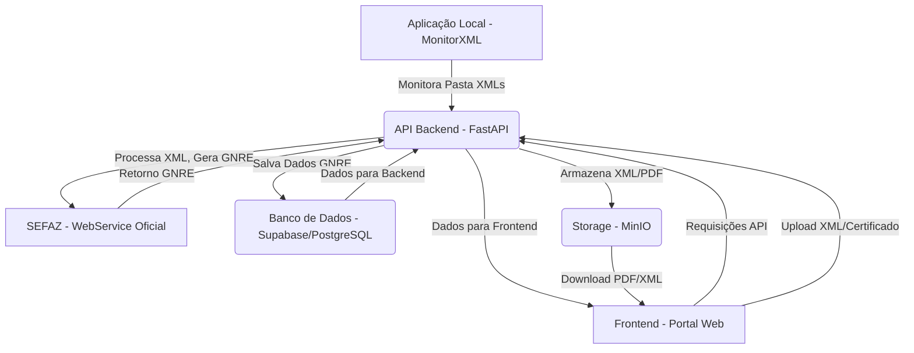

# Planejamento Detalhado da Aplicação de Geração de GNRE

## 1. Visão Geral da Arquitetura Consolidada

A arquitetura proposta para o sistema de Geração de GNRE será baseada em um modelo de microsserviços desacoplados, garantindo escalabilidade, manutenibilidade e resiliência. O sistema será composto por três pilares principais: Frontend (Aplicação Web), Backend (API) e Aplicação Local (Monitor de Pasta), todos interagindo com um Banco de Dados centralizado e um serviço de Armazenamento de Objetos.

**Fluxo de Dados Geral:**

## 2. Frontend (Portal Web)

O Frontend será uma Single Page Application (SPA) reativa e moderna, focada na experiência do usuário, com ênfase em segurança e performance.

### 2.1. Stack Tecnológica Consolidada

*   **Framework:** `React 18.3.1` com `Next.js 14+ (App Router)` para renderização híbrida (SSR para páginas públicas/SEO, CSR para dashboard interativo). A escolha do Next.js, embora não explicitamente mencionada no `FRONT.md`, é uma recomendação forte dos outros agentes (`Claude`, `GEMINI`, `OpenAI`) para otimização de performance e segurança (CSP headers automáticos).
*   **Linguagem:** `TypeScript 5.5.3` para tipagem estática e segurança de código.
*   **Estilização:** `Tailwind CSS 3.4.1` para desenvolvimento rápido e consistente de UI, complementado por `Shadcn UI` ou `Tremor React 3.14.1` para componentes de dashboard e analytics. A preferência do `FRONT.md` por `Tremor React` é mantida, mas `Shadcn UI` pode ser considerado para componentes mais genéricos.
*   **Gerenciamento de Estado:** `Zustand` (conforme `Claude` e `GEMINI`) ou `Context API` (conforme `FRONT.md`). A recomendação é iniciar com `Context API` para estados mais simples e migrar para `Zustand` ou `Redux Toolkit` se a complexidade do estado global aumentar, priorizando a simplicidade inicial.
*   **Formulários:** `React Hook Form` com `Zod` (validação) para gerenciamento e validação robusta de formulários.
*   **Comunicação com API:** `Axios` ou `TanStack Query (React Query)` para data fetching, cache e sincronização. `TanStack Query` é preferível para otimização de performance e experiência do desenvolvedor.
*   **Roteamento:** `React Router DOM 6.22.3` para roteamento client-side, com `Protected Routes Pattern`.
*   **Build Tools:** `Vite 6.3.5` para desenvolvimento rápido e `esbuild`/`Rollup`/`SWC` para otimização de produção.

### 2.2. Funcionalidades Principais

*   **Login e Autenticação:**
    *   Fluxo de login com e-mail/senha, recuperação de senha.
    *   Autenticação baseada em `JWT` com `refresh tokens` (armazenados em `HttpOnly`, `Secure`, `SameSite=Strict` cookies para segurança máxima).
    *   `Middleware` de proteção de rotas.
    *   Implementação de `MFA` (Multi-Factor Authentication) como TOTP, SMS, e-mail (conforme `Claude`).
    *   Políticas de senha robustas (mínimo 12 caracteres, complexidade, rotação).
    *   `Rate limiting` e bloqueio de tentativas de `brute-force`.
*   **Dashboard:**
    *   Visão geral com KPIs (GNREs geradas, pendentes, valor total).
    *   Gráficos de uso mensal/semanal.
    *   Alertas de vencimento de certificados ou GNREs.
*   **Tela de Geração de GNRE:**
    *   `UploadZone` (drag & drop) para múltiplos XMLs com validação de formato e tamanho.
    *   `GNRETable` com virtualização para grandes volumes, filtros, paginação, seleção múltipla.
    *   Ações por item (Gerar PDF, Impressão, Recálculo, Exclusão) e ações em lote.
    *   Exportação para layout bancário (`.rem`).
*   **Tela de Configurações:**
    *   Dados da Empresa (CNPJ, Razão Social, Endereço).
    *   `Upload` e gerenciamento de Certificado Digital (`.pfx`, `.p12`) com indicação de validade.
    *   Configurações de E-mail (SMTP).
    *   Gerenciamento de Usuários (CRUD, papéis).
    *   Geração e cópia de `Token da API` para aplicação local.
*   **Tela de Assinatura e Uso:**
    *   Integração com gateway de pagamento (Stripe/Pagar.me).
    *   Exibição do plano atual e medidor de uso.
    *   Histórico de faturas.

### 2.3. Foco em Segurança (Frontend)

*   **Prevenção de XSS:** Uso de React para `escape` automático de strings. Proibição de `dangerouslySetInnerHTML` e uso de `DOMPurify` para sanitização de inputs.
*   **Prevenção de CSRF:** Armazenamento de `JWT` em `HttpOnly`, `Secure`, `SameSite=Strict` cookies. Implementação de `CSRF tokens` em requisições POST/PUT/DELETE.
*   **Content Security Policy (CSP):** Configuração rigorosa no Next.js para limitar fontes de conteúdo.
*   **Segurança de Dependências:** Verificação automática de vulnerabilidades (`npm audit`, `Snyk`) no CI/CD.
*   **Validação Client-Side Robusta:** Uso de `Zod` para validação de schemas, complementando a validação de backend.
*   **Gerenciamento Seguro de Estado:** Criptografia de dados sensíveis em memória (`Zustand` com `CryptoJS`) para tokens e certificados.

## 3. Backend (API)

O Backend será o núcleo do sistema, projetado para ser `stateless`, seguro, eficiente e escalável.

### 3.1. Stack Tecnológica Consolidada

*   **Framework:** `FastAPI (Python 3.11)` é a escolha recomendada, conforme `BACK.md` e `OpenAI`. Embora `Claude` e `GEMINI` sugiram `Node.js/NestJS`, o `FastAPI` oferece alta performance, tipagem forte com `Pydantic` e uma excelente experiência de desenvolvimento em Python, que é uma linguagem robusta para processamento de dados e integração com sistemas legados (SEFAZ).
*   **Servidor ASGI:** `Uvicorn` para desenvolvimento e `Gunicorn` para produção.
*   **ORM:** `Prisma` (se Node.js fosse escolhido) ou ORM nativo do Python (como `SQLAlchemy` com `Alembic` para migrações) para interação com o PostgreSQL. A documentação `BACK.md` não especifica um ORM, mas o `Prisma` é uma boa prática para Node.js. Para Python, `SQLAlchemy` é a escolha padrão.
*   **Autenticação:** `Python-Jose` para `JWT` e `Passlib/Argon2/Bcrypt` para hashing seguro de senhas. `Passport.js` seria para Node.js.
*   **Validação de Dados:** `Pydantic` para validação de DTOs e `Joi` (se Node.js) para schemas rigorosos.
*   **Filas de Processamento:** `Bull/BullMQ` (se Node.js) ou uma solução baseada em `Redis` (`Celery` para Python) para processamento assíncrono de XMLs e geração de GNREs.
*   **Logging:** `Winston` (se Node.js) ou `Serilog` (se .NET) ou sistema de logging nativo do Python com `ELK Stack` ou `Logtail` para logging centralizado e imutável.
*   **Integração SEFAZ:** Biblioteca confiável para comunicação `SOAP` com webservices da SEFAZ.

### 3.2. Endpoints da API (RESTful)

A API será versionada (ex: `/api/v1/...`).

*   **Autenticação:**
    *   `POST /auth/login`: Autentica usuário, retorna JWT.
    *   `POST /auth/register`: Cadastra nova empresa e usuário.
    *   `POST /auth/refresh-token`: Obtém novo token de acesso.
    *   `POST /auth/forgot-password`, `POST /auth/reset-password`.
*   **Empresas:**
    *   `GET /companies/me`: Retorna dados da empresa logada.
    *   `PUT /companies/me`: Atualiza dados da empresa.
    *   `POST /companies/me/certificate`: Upload seguro de certificado digital.
    *   `POST /companies/me/api-token`: Gera novo token de API para aplicação local.
*   **GNRE:**
    *   `POST /gnre/process-xml`: Recebe XMLs do frontend, cria jobs em fila.
    *   `POST /gnre/from-local-agent`: Recebe dados de XMLs processados da aplicação local.
    *   `POST /gnre/send-batch`: Envia lote de GNREs para SEFAZ.
    *   `GET /gnre/config/:uf`: Consulta configurações específicas por UF.
    *   `GET /gnre/batch/:batchId`: Consulta status de lote.
    *   `GET /gnre/:id`: Consulta detalhes de GNRE específica.
    *   `GET /gnre`: Lista GNREs com filtros e paginação.
    *   `GET /gnre/:id/pdf`: Gera/retorna PDF da GNRE (via URL pré-assinada do MinIO).
*   **Upload/Storage:**
    *   `POST /upload/xml`: Upload de XMLs.
    *   `POST /upload/certificate`: Upload de certificados.
    *   `GET /files/:id`: Download de arquivos.

### 3.3. Foco em Segurança (Backend)

*   **Autenticação e Autorização Robusta:**
    *   `JWT` com algoritmo `RS256` (assimétrico) para assinatura.
    *   `Claims` do token com `sub`, `company_id`, `exp`.
    *   `Refresh tokens` com armazenamento de `hash SHA-256` no banco.
    *   `RBAC` (Role-Based Access Control) e `ABAC` (Attribute-Based Access Control) para permissões granulares.
*   **Validação de Entrada e Sanitização:**
    *   Uso de `DTOs` com `Pydantic` para validação rigorosa de tipo, tamanho, formato.
    *   Sanitização de strings para prevenir `SQL Injection`, `NoSQL Injection`, `XSS`.
    *   Uso de `queries parametrizadas` com o ORM.
*   **Rate Limiting e Proteção contra Brute Force:**
    *   `nestjs-throttler` (se Node.js) ou implementação similar com `Redis` para limitar requisições por IP/usuário em endpoints sensíveis.
*   **Segurança de Cabeçalhos HTTP:**
    *   Uso de `Helmet.js` (se Node.js) ou configuração manual de cabeçalhos como `Strict-Transport-Security` (HSTS), `X-Content-Type-Options`, `X-Frame-Options`.
*   **Gerenciamento de Segredos:**
    *   Utilização de serviços como `HashiCorp Vault`, `AWS Secrets Manager` ou `Doppler` para gerenciar chaves de API, senhas de banco, etc., evitando hardcoding.
*   **Manuseio Ultra-Seguro do Certificado Digital:**
    *   Upload via HTTPS, senha nunca logada.
    *   Criptografia do certificado e senha com `DEK` (Data Encryption Key) gerada por `KMS` (Key Management Service) como `AWS KMS` ou `HashiCorp Vault`.
    *   Armazenamento do certificado criptografado no MinIO e da `DEK` criptografada e senha criptografada no PostgreSQL.
*   **Auditoria e Logging Completo:**
    *   Registro de eventos sensíveis (login, upload, download, alterações) com timestamp, IP, ID do usuário.
    *   Alertas para atividades suspeitas (múltiplos logins falhos, acessos incomuns).
    *   Logs separados para segurança e auditoria.

## 4. Aplicação Local (Monitor de Pasta)

A aplicação local será um agente leve e robusto, executado no ambiente do cliente, responsável por monitorar pastas e enviar XMLs para a API.

### 4.1. Stack Tecnológica Consolidada

*   **Linguagem:** `Go (Golang)` é a escolha mais robusta e segura, conforme `GEMINI`. Embora `APP.md` sugira `.NET 8.0` e `Claude` sugira `Node.js/Electron`, o `Go` gera binários compilados, leves, de alta performance e multiplataforma, com menor superfície de ataque e sem dependências pesadas.
*   **Bibliotecas:** `fsnotify` para monitoramento eficiente de arquivos, `net/http` para comunicação com a API, e bibliotecas seguras de parsing de XML.
*   **Distribuição:** Binário assinado digitalmente (`Code Signing`) para Windows, evitando alertas de segurança.
*   **Instalador:** `NSIS` para criação de instaladores Windows.

### 4.2. Funcionalidades Principais

*   **Monitoramento:** Monitoramento em tempo real de pasta configurável para novos XMLs.
*   **Processamento:** Leitura, parse e extração de dados do XML. Aplicação de regras de negócio para identificar necessidade de GNRE.
*   **Comunicação:** Envio de dados para a API via `HTTPS` com autenticação por `token de API`.
*   **Pós-processamento:** Movimentação de XMLs para pastas `_processing`, `_processed` ou `_error` com logs detalhados.
*   **Configuração:** Leitura de arquivo de configuração local.

### 4.3. Foco em Segurança (Aplicação Local)

*   **Configuração Segura:** Armazenamento de `token_da_api` em armazenamento de credenciais nativo do SO (`Windows Credential Manager`, `Keychain`, `Secret Service API/Keyring`), não em arquivos de texto plano.
*   **Comunicação Segura (Prevenção de MITM):** Implementação de `Certificate Pinning` para confiar apenas em certificados SSL específicos do domínio da API.
*   **Manuseio de Arquivos Seguro:**
    *   Sanitização de nomes de arquivos para prevenir `Path Traversal` (`../`).
    *   Configuração do parser XML para desabilitar resolução de entidades externas (`XXE`).
    *   Validação de tamanho e extensão do arquivo antes do processamento.
    *   Verificação de `magic number` (cabeçalho do arquivo) para garantir que é um XML válido.
*   **Integridade do Binário:** Fornecimento de `hash SHA-256` do binário para verificação de integridade pelo usuário.
*   **Permissões Mínimas:** Execução do agente com privilégios limitados, acessando apenas a pasta monitorada.
*   **Sandboxing:** Considerar isolamento via contêiner ou `AppContainer` (Windows) para reduzir danos em caso de falha.

## 5. Banco de Dados e Armazenamento

### 5.1. Banco de Dados (Supabase / PostgreSQL)

*   **Escolha:** `Supabase (PostgreSQL)` é a escolha unânime e robusta para o banco de dados, oferecendo PostgreSQL gerenciado, autenticação e RLS.
*   **Modelo de Dados:**
    *   Tabelas: `companies`, `users`, `gnres`, `certificates`, `subscriptions`, `api_tokens`, `audit_log`, `gnre_batches`, `gnre_batch_items`.
    *   Campos de auditoria (`created_at`, `updated_at`, `user_id` para ações críticas).
    *   Enums para status (`GNREStatus`, `UserRole`).
*   **Segurança:**
    *   **Row-Level Security (RLS):** Ativação e políticas explícitas em todas as tabelas com dados de clientes para garantir que usuários só acessem seus próprios dados.
    *   **Criptografia em Nível de Coluna:** Uso de `pgcrypto` para criptografar campos ultra-sensíveis (ex: senha do certificado digital).
    *   **Gerenciamento de Acesso:** Roles no PostgreSQL com permissões limitadas para a API.
    *   **Backups:** Backups diários criptografados e geograficamente redundantes.
    *   **MFA:** Habilitar MFA para administradores do Supabase.
    *   **Políticas de Senha Forte:** Integradas com o Supabase Auth.
*   **Performance:**
    *   Criação de índices em colunas frequentemente consultadas (`company_id`, `status`, `created_at`).
    *   Índices para busca de texto (`to_tsvector`).
    *   Otimização de queries.

### 5.2. Armazenamento de Objetos (MinIO)

*   **Escolha:** `MinIO` é a escolha consistente para armazenamento de objetos S3-compatível e auto-hospedado.
*   **Estrutura de Buckets:**
    *   `gnre-xmls`: XMLs originais.
    *   `gnre-pdfs`: PDFs das guias.
    *   `digital-certificates`: Certificados digitais (acesso restrito).
*   **Estrutura de Pastas (Object Keys):** Organização por `{company_id}/{year}/{month}/{file_id}.ext`.
*   **Segurança e Acesso:**
    *   Buckets **NÃO PÚBLICOS**.
    *   Acesso via API usando chaves de acesso (`Access Key/Secret Key`).
    *   `URLs Pré-Assinadas (Presigned URLs)` com tempo de expiração curto para downloads no frontend.
    *   Políticas de acesso restritivas (`IAM`) no MinIO, com "negação por padrão".
    *   Validação do lado do servidor e varredura de malware (`ClamAV`) em uploads.
    *   Criptografia em repouso (`SSE-S3`) e em trânsito (`HTTPS/TLS`).
    *   Logs de acesso e alertas para atividades anormais.

## 6. Segurança Abrangente (Princípios e Práticas)

A segurança será um pilar fundamental em todas as camadas do sistema, seguindo os princípios de:

*   **Defense in Depth (Defesa em Profundidade):** Múltiplas camadas de segurança independentes.
*   **Princípio do Menor Privilégio (PoLP):** Cada componente com as permissões estritamente necessárias.
*   **Zero Trust (Confiança Zero):** Nunca confiar, sempre verificar.
*   **Secure by Design & Default:** Segurança incorporada desde o início.
*   **Auditoria Completa:** Rastreabilidade de todas as ações críticas.

**Medidas Gerais de Segurança:**

*   **Autenticação e Autorização:** JWT robusto, MFA, RBAC/ABAC, políticas de senha forte, detecção de anomalias.
*   **Criptografia:** Dados em repouso (banco, storage) e em trânsito (HTTPS/TLS 1.2+, Certificate Pinning). Criptografia de dados sensíveis em nível de coluna/memória.
*   **Validação e Sanitização:** Validação rigorosa de todas as entradas (frontend, backend), sanitização de HTML/XML, prevenção de injeções (SQL, XXE).
*   **Rate Limiting:** Proteção contra ataques de força bruta e DDoS.
*   **Gerenciamento de Segredos:** Uso de cofres de segredos (Vault, KMS).
*   **Monitoramento e Logs:** Logging estruturado, centralizado e imutável. Alertas para eventos de segurança.
*   **CI/CD Seguro:** Scans automáticos de segurança (SAST, DAST), verificação de dependências (`npm audit`, `Snyk`).
*   **Testes de Segurança:** Testes de penetração regulares, simulações de incidentes.
*   **Compliance:** LGPD/GDPR (consentimento, direito ao esquecimento, logs de acesso).
*   **Infraestrutura Segura:** WAF, proteção DDoS, segmentação de rede, VPC isolada, Security Groups restritivos, backups criptografados.

## 7. Velocidade e Escalabilidade

*   **Frontend:**
    *   `Lazy Loading` e `Code Splitting` para carregamento rápido.
    *   `SSR/CSR` otimizado com Next.js.
    *   `Vite` para desenvolvimento rápido e `esbuild` para builds de produção.
    *   `TanStack Query` para cache e sincronização de dados.
    *   Virtualização de tabelas (`TanStack Table` com `TanStack Virtual`) para grandes volumes de dados.
*   **Backend:**
    *   `FastAPI` para alta performance e baixo consumo de recursos.
    *   Arquitetura `stateless` para fácil escalabilidade horizontal.
    *   Filas de processamento (`Redis/Celery`) para operações assíncronas e desacoplamento.
    *   `Redis` para cache de dados frequentemente acessados.
    *   Otimização de queries de banco de dados com índices.
*   **Banco de Dados:**
    *   `PostgreSQL` com otimizações de índices e queries.
    *   `Supabase` oferece escalabilidade gerenciada.
*   **Armazenamento:**
    *   `MinIO` para armazenamento escalável de objetos.
    *   `URLs Pré-Assinadas` para descarregar o backend no download de arquivos.
*   **Infraestrutura:**
    *   Containerização (`Docker`) e orquestração (`Docker Compose` para dev/homologação, `Kubernetes` para produção) para escalabilidade e resiliência.
    *   `CI/CD` automatizado para deploys rápidos e consistentes.

## 8. Cronograma e Recursos (Estimativa Consolidada)

O cronograma é uma estimativa e pode variar conforme a complexidade exata das integrações com a SEFAZ e a disponibilidade da equipe.

**Equipe Recomendada:**

*   1 Tech Lead / Arquiteto (full-time)
*   2 Desenvolvedores Backend (full-time)
*   2 Desenvolvedores Frontend (full-time)
*   1 DevOps Engineer (part-time)
*   1 QA Engineer (part-time)

**Fases de Desenvolvimento (Estimativa de 12 semanas):**

*   **Fase 1 (Semanas 1-2): Fundação e Infraestrutura**
    *   Setup do Supabase (schema, RLS, Auth).
    *   Configuração do MinIO (buckets, políticas).
    *   Estrutura base dos projetos Frontend, Backend e Aplicação Local.
    *   Configuração de ambientes de desenvolvimento.
*   **Fase 2 (Semanas 3-4): Backend Core e Autenticação**
    *   API de autenticação (login, registro, refresh token).
    *   CRUD de empresas.
    *   Sistema de upload seguro de certificados.
    *   Geração de token de API para aplicação local.
*   **Fase 3 (Semanas 5-6): Frontend Base e GNRE (Upload/Listagem)**
    *   Sistema de autenticação no Frontend.
    *   Dashboard básico.
    *   Tela de configurações.
    *   Componente de upload de XMLs.
    *   Tabela de listagem de GNREs (dados mockados inicialmente).
*   **Fase 4 (Semanas 7-8): Lógica de Negócio GNRE e Integração SEFAZ**
    *   Processamento de XML no Backend.
    *   Integração com webservices da SEFAZ (geração de GNRE).
    *   Geração de PDFs.
    *   Implementação de filas de processamento.
    *   Testes de integração com a SEFAZ.
*   **Fase 5 (Semanas 9-10): Aplicação Local e Refinamento Frontend**
    *   Desenvolvimento do Monitor de Pasta (Go).
    *   Integração da Aplicação Local com a API.
    *   Interface de configuração local.
    *   Polimento de UX/UI no Frontend.
    *   Implementação de filtros e ações em lote no Frontend.
*   **Fase 6 (Semanas 11-12): Finalização, Segurança e Deploy**
    *   Sistema de assinatura e gerenciamento de uso.
    *   Revisão e implementação de todas as medidas de segurança detalhadas.
    *   Testes completos (unitários, integração, e2e, segurança).
    *   Configuração de CI/CD e monitoramento.
    *   Deploy em ambiente de produção.

## 9. Justificativas para Divergências

*   **Backend (Python/FastAPI vs Node.js/NestJS/Express):**
    *   **Sua escolha (`BACK.md`):** Python 3.11 com FastAPI.
    *   **Outras sugestões:** Node.js com Express.js/Fastify (`Claude`), NestJS (`GEMINI`).
    *   **Justificativa:** A escolha do Python com FastAPI é **validada e recomendada**. FastAPI é um framework moderno, de alta performance, com tipagem forte (Pydantic) e excelente para construir APIs. Para um sistema que envolve processamento de dados fiscais e integração com sistemas legados (SEFAZ, que muitas vezes usam SOAP), Python é uma linguagem muito capaz e com um ecossistema maduro para essas tarefas. A performance do FastAPI é comparável ou superior a muitos frameworks Node.js em cenários de I/O bound. Manter uma stack mais homogênea (Python para backend e Go para aplicação local) pode simplificar a curva de aprendizado da equipe em comparação com Node.js/TypeScript para backend e Go para aplicação local.
*   **Frontend (React/Vite/Context API vs Next.js/Zustand/Shadcn):**
    *   **Sua escolha (`FRONT.md`):** React 18.3.1, TypeScript 5.5.3, Vite 6.3.5, Context API, Tailwind CSS, Tremor React.
    *   **Outras sugestões:** Next.js 14+, Shadcn/ui, Zustand, Tanstack Query (`Claude`, `GEMINI`, `OpenAI`).
    *   **Justificativa:** A base do seu `FRONT.md` é **excelente e moderna**. A sugestão de incorporar `Next.js` é para aproveitar recursos como `SSR/SSG` (melhor SEO para páginas públicas, carregamento inicial mais rápido), `App Router` (melhor organização de rotas e data fetching) e `CSP headers` automáticos, que são cruciais para segurança e performance em aplicações corporativas. `Shadcn UI` é uma biblioteca de componentes headless que se integra perfeitamente com `Tailwind CSS` e oferece alta customização, sendo uma alternativa robusta ao `Tremor React` para componentes mais genéricos, enquanto `Tremor` pode ser mantido para dashboards específicos. `Zustand` é uma biblioteca de gerenciamento de estado leve e performática, uma boa evolução da `Context API` para estados mais complexos. `Tanstack Query` é um padrão de mercado para data fetching e cache. A recomendação é **integrar esses elementos** para elevar o nível do frontend, mantendo a base sólida que você já definiu.
*   **Aplicação Local (Go vs .NET/Windows Forms vs Node.js/Electron):**
    *   **Sua escolha (`APP.md`):** .NET 8.0, Windows Forms.
    *   **Outras sugestões:** Go (`GEMINI`), Node.js/Electron (`Claude`).
    *   **Justificativa:** A escolha do `Go` para a aplicação local é **fortemente recomendada** em detrimento de `.NET/Windows Forms` ou `Node.js/Electron`.
        *   **Performance e Leveza:** Binários Go são extremamente leves e performáticos, ideais para rodar em segundo plano sem consumir muitos recursos do cliente. `.NET/Windows Forms` pode ser mais pesado e `Electron` é notoriamente conhecido por alto consumo de RAM.
        *   **Multiplataforma:** Embora o foco seja Windows, Go facilita a criação de binários para Linux/macOS se houver necessidade futura.
        *   **Segurança:** Go oferece um controle mais granular sobre o sistema de arquivos e rede, facilitando a implementação de medidas de segurança como `Certificate Pinning` e sanitização de `Path Traversal/XXE` de forma mais robusta e com menor superfície de ataque do que um ambiente de runtime como Node.js ou .NET. A distribuição como um único binário simplifica a instalação e reduz a complexidade de dependências.
        *   **Distribuição:** A criação de instaladores com `NSIS` é compatível com binários Go.
    *   Portanto, a sugestão é **migrar a aplicação local para Go** para maximizar segurança, performance e facilidade de distribuição.